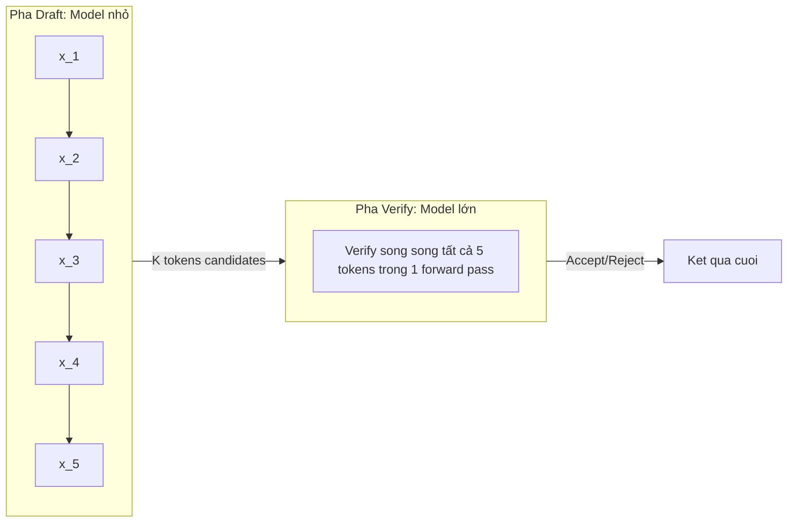

# Case 4: Speculative Decoding - Draft Model + Target Model

## 1. Bối cảnh

LLM inference bị bottleneck bởi memory bandwidth, đặc biệt ở giai đoạn decode (sinh từng token một). Speculative Decoding là kỹ thuật dùng một mô hình nhỏ (draft model) sinh nhanh nhiều token, rồi dùng mô hình lớn (target model) verify song song tất cả cùng lúc, đạt tốc độ 2-3x mà không thay đổi chất lượng output.

---

## 2. Nguyên lý hoạt động

### Thuật toán cốt lõi



1. **Draft Phase**: mô hình nhỏ (ví dụ Llama 160M) sinh K token candidates: $x_1, x_2, \ldots, x_K$.
2. **Verify Phase**: mô hình lớn (ví dụ Llama 70B) thực hiện **1 forward pass duy nhất** trên toàn bộ chuỗi $[x_1, \ldots, x_K]$ để tính xác suất $p_{target}(x_i | x_{\lt i})$.
3. **Accept/Reject**: so sánh xác suất draft và target, accept các token khớp, reject từ token đầu tiên sai.

### Xác suất chấp nhận

Token $x_i$ được chấp nhận với xác suất:

$$\alpha_i = \min\left(1, \frac{p_{target}(x_i | x_{\lt i})}{p_{draft}(x_i | x_{\lt i})}\right)$$

Nếu $p_{target} \geq p_{draft}$, token luôn được chấp nhận ($\alpha = 1$). Nếu draft model dự đoán sai hướng, token bị reject và mô hình lớn sinh lại token đó.

### Kỳ vọng số token accept

$$\mathbb{E}[\text{accepted}] = \sum_{i=1}^{K} \prod_{j=1}^{i} \alpha_j$$

Khi draft model có phân phối gần target model, $\alpha_i \approx 1$ và ta accept gần hết K tokens, đạt speedup ~Kx.

---

## 3. Triển khai trong llama.cpp

### Cấu hình

```bash
# Draft model nhỏ (cùng kiến trúc)
./llama-cli \
    -m llama-70b-q4_k_m.gguf \
    -md llama-160m-q8_0.gguf \
    -p "Explain quantum entanglement:" \
    -n 200 \
    --draft 16 \
    -t 8
```

| Flag | Ý nghĩa |
|:---|:---|
| `-m` | Target model (lớn, chính xác) |
| `-md` | Draft model (nhỏ, nhanh) |
| `--draft K` | Số token draft mỗi vòng (mặc định 16) |

### Draft model tương thích

Draft model **phải** dùng cùng vocabulary và tokenizer với target model:

- Llama 3 8B + Llama 3.2 1B: cùng tiktoken tokenizer.
- Qwen2.5 72B + Qwen2.5 0.5B: cùng vocabulary.
- Không thể mix khác architecture (ví dụ Llama + Qwen) vì vocab khác nhau.

---

## 4. Phân tích hiệu năng thực tế

### Thí nghiệm: Llama 3 8B + Llama 3.2 1B

| Cấu hình | Tokens/sec | Speedup | Acceptance Rate |
|:---|:---|:---|:---|
| Baseline (chỉ 8B) | 25 t/s | 1.0x | - |
| Speculative K=8 | 55 t/s | 2.2x | ~78% |
| Speculative K=16 | 62 t/s | 2.5x | ~72% |
| Speculative K=32 | 58 t/s | 2.3x | ~61% |

Nhận xét:
- K quá nhỏ: không khai thác đủ parallelism của verify phase.
- K quá lớn: draft model sinh nhiều token sai, acceptance rate giảm, lãng phí compute.
- **Sweet spot**: K = 12-16 cho hầu hết cặp model.

### Yếu tố ảnh hưởng acceptance rate

1. **Độ tương đồng kiến trúc**: cùng architecture family cho acceptance cao hơn.
2. **Kích thước ratio**: draft/target ratio 1:10 đến 1:50 cho kết quả tốt.
3. **Nhiệt độ sampling**: temperature cao làm draft diverge nhiều hơn, giảm acceptance.
4. **Domain**: code generation có acceptance cao hơn creative writing (do predictable hơn).

---

## 5. Self-Speculative Decoding

Khi không có draft model phù hợp, llama.cpp hỗ trợ **self-speculative decoding**: target model tự dùng early layers làm "draft":

```bash
./llama-cli \
    -m llama-70b.gguf \
    --lookup-cache static \
    -p "..." \
    -n 200
```

Cơ chế này dùng **n-gram lookup table** từ các token đã sinh trước đó để draft, không cần mô hình phụ. Phù hợp khi:
- Không có draft model tương thích.
- Bộ nhớ không đủ tải 2 model cùng lúc.
- Text có tính lặp cao (code, templates).

---

## 6. Kết luận

Speculative Decoding là kỹ thuật tăng tốc inference **lossless** (không giảm chất lượng) hiệu quả nhất trong llama.cpp. Chìa khóa nằm ở việc chọn draft model phù hợp (cùng vocab, tỷ lệ size hợp lý) và tinh chỉnh K. Speedup 2-3x là hoàn toàn khả thi trên thực tế mà không cần thay đổi phần cứng.
