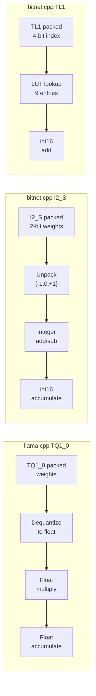

# Case Study 6: So sánh bitnet.cpp và llama.cpp cho Ternary LLM

Case study này benchmark hai framework khi chạy cùng một ternary model, phân tích sự khác biệt về kernel implementation, accuracy, và use cases phù hợp.

---

## 1. Bối cảnh

Giả sử cần deploy model **BitNet-b1.58-2B-4T** (2.4B parameters, ternary weights) trên **Apple M2** để chạy inference tại edge.

Hai lựa chọn:
1. **llama.cpp**: Dùng TQ1_0 hoặc TQ2_0 ternary quantization
2. **bitnet.cpp**: Dùng I2_S hoặc TL1 kernel chuyên biệt

Cả hai đều đọc cùng format GGUF. Model file giống nhau.

---

## 2. Thiết lập Benchmark

| Thông số | Giá trị |
|:---|:---|
| Hardware | Apple M2, 8-core CPU |
| Model | BitNet-b1.58-2B-4T (2.4B params) |
| Prompt | 128 tokens |
| Generation | 256 tokens |
| Threads | 4 (default) |

---

## 3. Kết quả Benchmark

### 3.1. Performance

| Metric | llama.cpp (TQ1_0) | bitnet.cpp (I2_S) | bitnet.cpp (TL1) |
|:---|:---|:---|:---|
| tokens/sec | ~45 | ~85 | ~92 |
| First token latency | ~120 ms | ~65 ms | ~58 ms |
| Memory usage | ~1.2 GB | ~0.5 GB | ~0.5 GB |

### 3.2. Accuracy (Lossless Match to FP32)

| Framework | Ternary Quant | Lossless Match |
|:---|:---|:---|
| llama.cpp TQ1_0 | PTQ dequantize -> float | **1.4%** |
| llama.cpp TQ2_0 | PTQ dequantize -> float | **1.4%** |
| bitnet.cpp I2_S | Exact ternary compute | **100%** |
| bitnet.cpp TL1 | Exact LUT compute | **100%** |

### 3.3. Energy

| Framework | J/token | Reduction |
|:---|:---|:---|
| llama.cpp (FP16 baseline) | 3.01 | - |
| llama.cpp (TQ1_0) | ~2.1 | ~30% |
| bitnet.cpp (I2_S) | 1.07 | **64.5%** |
| bitnet.cpp (TL1) | ~0.95 | **68.4%** |

---

## 4. Phân tích

### 4.1. Tại sao llama.cpp TQ chỉ đạt 1.4% accuracy?

llama.cpp được thiết kế cho **general-purpose inference** với 30+ quantization types. Ternary types (TQ1_0, TQ2_0) được thêm vào nhưng kernel vẫn theo pattern:

```
dequantize -> float -> multiply-accumulate
```

Quá trình dequantize ternary về float là **approximate** - mất thông tin vì float representation không thể biểu diễn chính xác {-1, 0, +1} trong mọi trường hợp.

bitnet.cpp thực hiện computation **trực tiếp trong miền ternary**:
```
ternary weights + INT8 activations -> lookup/add -> int16 accumulate
```

Không có bước dequantize nào, kết quả là **exact integer computation**.

### 4.2. Kernel Architecture So sánh



### 4.3. Khi nào dùng framework nào?

| Scenario | Framework | Lý do |
|:---|:---|:---|
| Ternary model, accuracy critical | **bitnet.cpp** | 100% lossless accuracy |
| Ternary model, quick prototype | llama.cpp | Có sẵn, không cần build riêng |
| Non-ternary model (FP16, Q4, Q8) | **llama.cpp** | 30+ quant types, không hỗ trợ bởi bitnet.cpp |
| GPU inference | llama.cpp | bitnet.cpp GPU support mới thêm (2025) |
| Edge device, tối ưu energy | **bitnet.cpp** | 55-82% energy reduction |
| Multi-model serving | llama.cpp | Hỗ trợ nhiều model architectures |

---

## 5. Compatibility

### 5.1. Model Format

Cả hai đều dùng **GGUF**. Model BitNet GGUF file có thể load bởi cả llama.cpp và bitnet.cpp.

### 5.2. Build Requirements

| Yêu cầu | llama.cpp | bitnet.cpp |
|:---|:---|:---|
| Compiler | GCC/Clang/MSVC | **Clang >= 18** |
| Dependencies | Minimal (CMake) | Python 3.9+, CMake, Clang |
| Build complexity | Đơn giản | Phức tạp hơn (setup_env.py) |

### 5.3. Shared Foundation

bitnet.cpp sử dụng llama.cpp làm submodule (`3rdparty/llama.cpp`), share:
- GGML tensor library
- GGUF model format reader
- Tokenizer, sampling, text generation
- CLI interface (llama-cli, llama-bench)

---

## 6. Kết luận

**bitnet.cpp** là lựa chọn tối ưu khi:
- Model là **native ternary** (trained with QAT/STE, không phải FP16 quantized)
- Cần **lossless accuracy** so với FP32 reference
- Ưu tiên **energy efficiency** trên edge devices

**llama.cpp** vẫn là lựa chọn đúng khi:
- Model không phải ternary (Q4_K_M, Q8_0, IQ4_NL...)
- Cần hỗ trợ GPU
- Cần flexibility với nhiều model architectures

Cả hai framework bổ sung cho nhau trong ecosystem LLM inference.

---

## Tham khảo

- Microsoft BitNet: https://github.com/microsoft/BitNet
- llama.cpp: https://github.com/ggml-org/llama.cpp
- PR #7931: BitNet model support in llama.cpp
