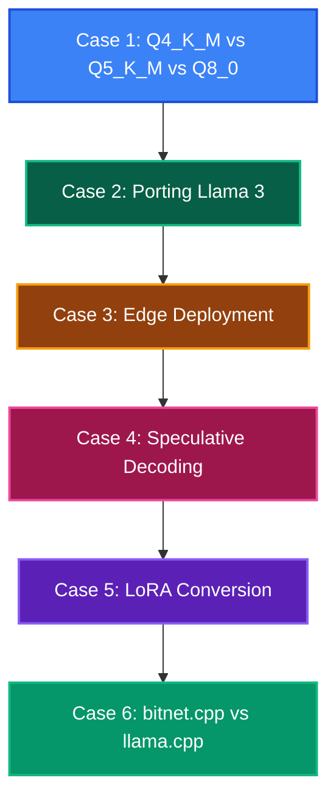

# Lộ trình Case Studies Thực chiến với llama.cpp

Chào mừng bạn đến với chương **Case Studies Thực chiến**. Sau khi đã nắm vững lý thuyết cốt lõi (từ Bài 0 đến Bài 9), phần này sẽ đưa bạn vào các kịch bản thực tế khi deploy và tối ưu llama.cpp.

---

---

## Nội dung Case Studies

1. **[Case 1: Q4_K_M vs Q5_K_M vs Q8_0](case_1_quant_comparison)** - So sánh chất lượng, tốc độ và bộ nhớ giữa các quant types phổ biến.
2. **[Case 2: Porting Llama 3 từ HuggingFace sang GGUF](case_2_llama3_porting)** - Hướng dẫn chi tiết convert model mới nhất.
3. **[Case 3: Edge Deployment trên Raspberry Pi và Điện thoại](case_3_edge_deployment)** - Tối ưu cho thiết bị giới hạn.
4. **[Case 4: Speculative Decoding - Tăng tốc 2-3x](case_4_speculative_decoding)** - Draft model + target model strategy.
5. **[Case 5: Chuyển đổi LoRA Adapter sang GGUF](case_5_lora_conversion)** - Fine-tuned model conversion pipeline.
6. **[Case 6: bitnet.cpp vs llama.cpp cho Ternary LLM](case_6_bitnet_vs_llamacpp)** - Benchmark performance, accuracy, energy khi chạy ternary model trên cả hai framework.
