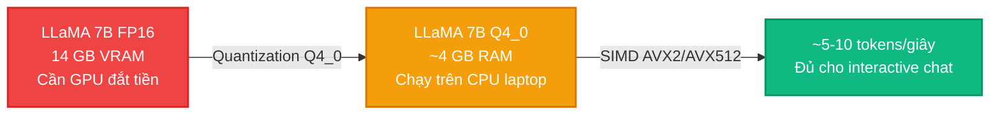
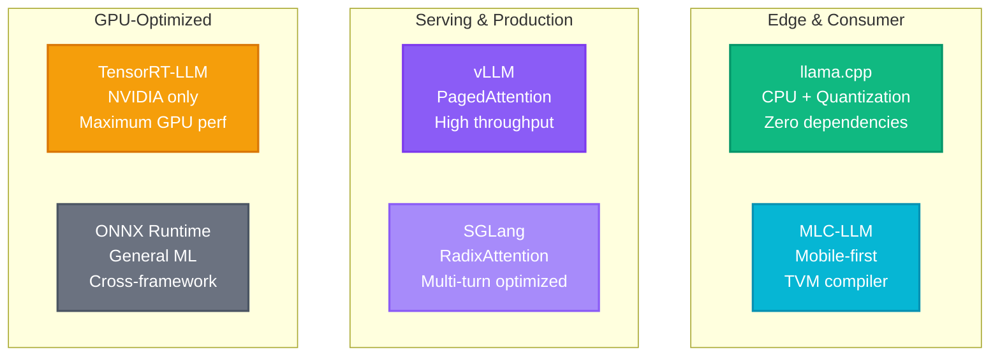
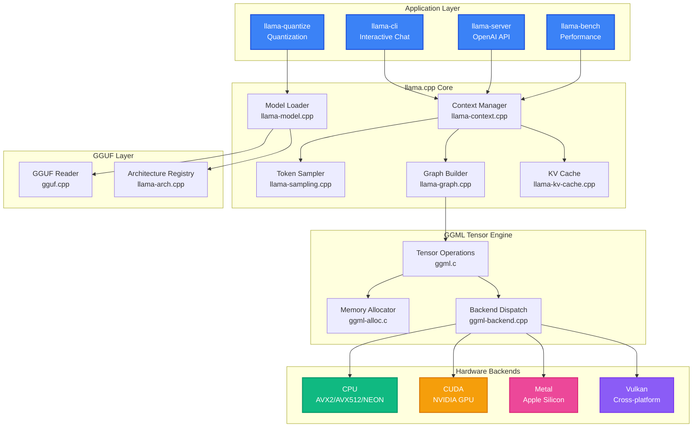

# Bài 0: llama.cpp và Cuộc cách mạng Inference trên CPU

Trước khi đi sâu vào kiến trúc kỹ thuật, chúng ta cần hiểu rõ **tại sao llama.cpp ra đời** và nó giải quyết bài toán hệ thống nào mà các framework trước đó không làm được. Bài học này sẽ đặt nền móng cho toàn bộ chuỗi bài giảng bằng cách phân tích động lực, bối cảnh và vị trí của llama.cpp trong landscape inference LLM hiện đại.

---

## 1. Bối cảnh: Nghịch lý Phần cứng trong LLM Inference

Vào đầu năm 2023, khi Meta công bố mô hình LLaMA (7B, 13B, 33B, 65B), cộng đồng nghiên cứu đối mặt với một nghịch lý:

- Mô hình 7B ở độ chính xác FP16 chiếm **14 GB VRAM**, vừa đủ cho GPU consumer (RTX 3090 có 24 GB).
- Nhưng mô hình 13B cần **26 GB VRAM**, vượt quá dung lượng GPU consumer phổ biến.
- Mô hình 65B cần **130 GB VRAM**, đòi hỏi nhiều GPU A100 đắt tiền.

Trong khi đó, inference (suy luận) khác hoàn toàn với training (huấn luyện):

- **Training** yêu cầu lưu optimizer states, gradients, activations, tổng chi phí bộ nhớ gấp 4-6 lần trọng số mô hình. GPU là bắt buộc.
- **Inference** chỉ cần trọng số mô hình + KV Cache, chi phí bộ nhớ thấp hơn nhiều. Về lý thuyết, CPU với RAM lớn hoàn toàn có thể đảm nhiệm.

Nhưng các framework inference phổ biến lúc bấy giờ (HuggingFace Transformers, ONNX Runtime, TensorRT) đều thiết kế quanh GPU, bỏ qua tiềm năng khổng lồ của CPU hiện đại với AVX2/AVX512 và bộ nhớ RAM lên tới 128-256 GB.

---

## 2. llama.cpp ra đời: Tháng 3/2023

Vào ngày 10 tháng 3 năm 2023, **Georgi Gerganov**, một lập trình viên người Bulgaria, công bố dự án `llama.cpp` trên GitHub. Mục tiêu ban đầu rất đơn giản: **chạy mô hình LLaMA 7B trên MacBook bằng CPU thuần túy**.

### 2.1. Triết lý thiết kế cốt lõi

Gerganov áp dụng ba nguyên tắc thiết kế then chốt:

1. **Zero dependencies**: Toàn bộ thư viện viết bằng C/C++ thuần, không phụ thuộc vào PyTorch, TensorFlow hay bất kỳ framework ML nào. Điều này cho phép biên dịch trên mọi nền tảng từ macOS, Linux, Windows đến Android, iOS.

2. **Quantization làm vũ khí chính**: Thay vì chạy FP16 (16 bit/trọng số), llama.cpp nén trọng số xuống 4-bit (Q4_0), giảm 4 lần bộ nhớ mà vẫn giữ chất lượng chấp nhận được. Mô hình 7B từ 14 GB xuống còn khoảng **4 GB**, chạy được trên laptop 8 GB RAM.

3. **SIMD optimization tối đa**: Tận dụng các tập lệnh vector của CPU (AVX2 xử lý 8 số FP32 cùng lúc, AVX512 xử lý 16 số) để tăng tốc tính toán matrix multiplication, vốn là bottleneck của inference.

### 2.2. Tại sao CPU có thể inference LLM?

Đây là câu hỏi quan trọng nhất. Câu trả lời nằm ở **memory bandwidth bottleneck** (nghẽn cổ chai băng thông bộ nhớ):

LLM inference, đặc biệt là giai đoạn decode (sinh token từng cái một), là bài toán **memory-bound**, không phải compute-bound. Với mỗi token mới, hệ thống cần:

1. Đọc toàn bộ trọng số mô hình từ bộ nhớ (RAM hoặc VRAM).
2. Thực hiện matrix-vector multiplication (vì batch size = 1 khi decode).
3. Kết quả là một vector logits, rồi sample ra token tiếp theo.

Tốc độ bị giới hạn bởi **băng thông bộ nhớ**, không phải số phép tính FLOPS:

$$\text{Tokens/giây} \approx \frac{\text{Băng thông bộ nhớ (GB/s)}}{\text{Kích thước mô hình (GB)}}$$

| Platform | Băng thông bộ nhớ | LLaMA 7B FP16 (14 GB) | LLaMA 7B Q4_0 (4 GB) |
|:---|:---|:---|:---|
| DDR4 RAM (CPU) | ~25 GB/s | ~1.8 tok/s | ~6.3 tok/s |
| DDR5 RAM (CPU) | ~50 GB/s | ~3.6 tok/s | ~12.5 tok/s |
| Apple M2 (Unified) | ~100 GB/s | ~7.1 tok/s | ~25 tok/s |
| RTX 3090 (VRAM) | ~936 GB/s | ~67 tok/s | ~234 tok/s |

Đọc bảng trên, ta thấy CPU với DDR5 RAM có thể đạt **12-13 tokens/giây** cho mô hình Q4_0, đủ cho trải nghiệm chat tương tác (con người đọc khoảng 5-7 tokens/giây). Apple Silicon với unified memory bandwidth 100+ GB/s thậm chí đạt 25+ tokens/giây.

---

## 3. Tổng quan LLM Inference Landscape (2023-2025)

Để hiểu vị trí của llama.cpp, chúng ta cần so sánh nó với các framework inference khác:

### 3.1. Bốn trường phái Inference

### 3.2. So sánh chi tiết

| Tiêu chí | llama.cpp | vLLM | TensorRT-LLM | ONNX Runtime |
|:---|:---|:---|:---|:---|
| **Phần cứng** | CPU + GPU đa nền | GPU (NVIDIA, AMD) | NVIDIA only | CPU + GPU |
| **Ngôn ngữ** | C/C++ | Python + CUDA C++ | C++ + Python | C++ + Python |
| **Dependencies** | Zero | PyTorch, CUDA, Ray | CUDA, TensorRT | ONNX, Protobuf |
| **Quantization** | 30+ loại (Q2_K-IQ4_NL) | AWQ, GPTQ, FP8 | FP8, INT4, INT8 | INT8, FP16 |
| **Mục tiêu** | Single-user, edge | Multi-user serving | Maximum NVIDIA perf | General ML inference |
| **Throughput** | Thấp-trung bình | Rất cao (batching) | Rất cao | Trung bình |
| **Latency** | Thấp (single request) | Trung bình (batch) | Rất thấp | Trung bình |
| **Dung lượng** | ~50 MB binary | ~2 GB (PyTorch) | ~5 GB (CUDA+TRT) | ~500 MB |

### 3.3. Khi nào nên dùng llama.cpp?

llama.cpp tỏa sáng trong các tình huống sau:

1. **Edge deployment**: Chạy LLM trên Raspberry Pi, điện thoại Android/iOS, laptop không có GPU rời.
2. **Privacy-first inference**: Toàn bộ inference chạy local, không cần gửi data lên cloud.
3. **Rapid prototyping**: Tải và chạy mô hình mới trong vài phút, không cần setup phức tạp.
4. **Resource-constrained environments**: Docker container nhỏ, embedded systems, CI/CD pipelines.
5. **Apple Silicon**: Tận dụng unified memory và Metal GPU backend để đạt hiệu năng cao trên Mac.
6. **Quantization research**: Thử nghiệm các phương pháp quantization mới với codebase C minh bạch.

---

## 4. Kiến trúc tổng quan của llama.cpp

Trước khi đi sâu vào từng thành phần, hãy nhìn bức tranh tổng thể:

Kiến trúc này được tổ chức thành **bốn tầng trừu tượng**:

1. **Application Layer**: Các công cụ đầu cuối (CLI, Server, Benchmark, Quantize). Mỗi công cụ chỉ gọi API của tầng Core.
2. **llama.cpp Core**: Tầng điều phối chính, quản lý mô hình, context inference, sampling, KV Cache và xây dựng computation graph.
3. **GGUF Layer**: Đọc file GGUF, parse metadata và ánh xạ kiến trúc mô hình.
4. **GGML Tensor Engine**: Tầng thấp nhất, thực hiện tính toán tensor thực sự, quản lý bộ nhớ và dispatch đến hardware backends.

---

## 5. Evolution: Từ GGML đến GGUF

Lịch sử llama.cpp gắn liền với sự tiến hóa của định dạng mô hình:

| Giai đoạn | Định dạng | Đặc điểm |
|:---|:---|:---|
| Tháng 3/2023 | GGML v1 | Định dạng đầu tiên, đơn giản, không hỗ trợ metadata mở rộng |
| Tháng 5/2023 | GGML v2/v3 | Thêm hỗ trợ quantization types mới, nhưng vẫn thiếu metadata |
| Tháng 8/2023 | **GGUF** | Định dạng mới hoàn toàn: metadata key-value, 32-byte alignment, versioning |
| 2024-2025 | GGUF v3 | Hỗ trợ 30+ quant types, importance matrix, multi-modal models |

Bài học tiếp theo sẽ đi sâu vào GGML (Bài 1) và GGUF (Bài 2) để hiểu rõ cấu trúc dữ liệu nền tảng mà llama.cpp xây dựng lên trên.

---

## 💡 Đúc kết Bài 0

llama.cpp không phải là framework inference nhanh nhất hay mạnh nhất. Nhưng nó là framework **dân chủ hóa** inference LLM, biến việc chạy mô hình 7B-13B từ yêu cầu GPU đắt tiền thành khả năng chạy trên laptop thông thường. Sự kết hợp giữa quantization thông minh, SIMD optimization tối đa, và zero dependencies tạo nên một công cụ độc nhất trong landscape inference hiện đại.

Trong các bài tiếp theo, chúng ta sẽ đi từ dưới lên: bắt đầu từ thư viện tensor GGML (Bài 1), định dạng GGUF (Bài 2), rồi đến giải thuật quantization (Bài 3) trước khi phân tích inference engine hoàn chỉnh (Bài 4).
