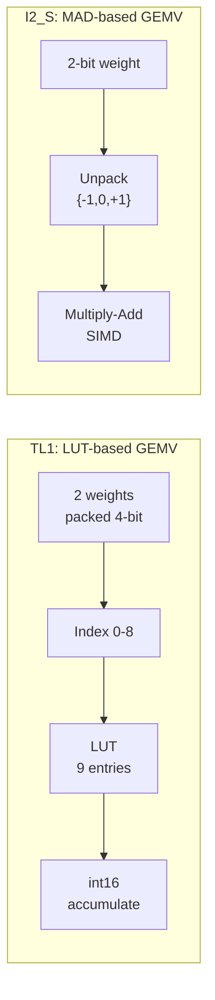
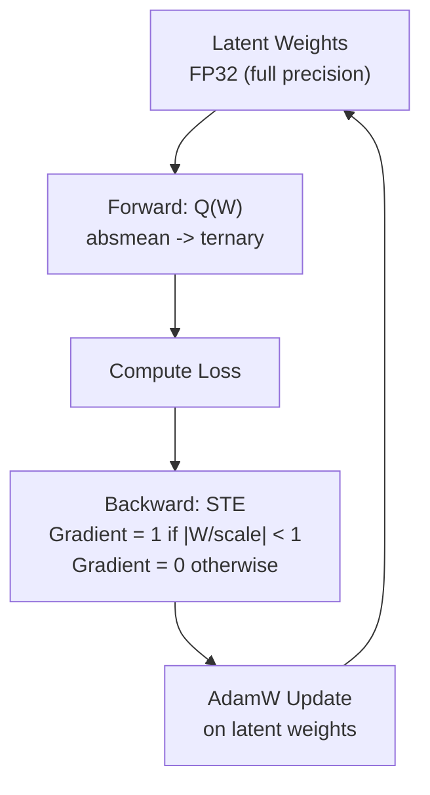

# Bài 10: BitNet b1.58 & bitnet.cpp - Inference cho LLM Ternary

Trong khi llama.cpp giải quyết bài toán inference cho LLM bằng post-training quantization (PTQ), một hướng tiếp cận hoàn toàn khác xuất hiện: **đào tạo model ngay từ đầu với trọng số ternary** {-1, 0, +1}. BitNet b1.58 (Microsoft, 2024) chứng minh rằng một model với 1.58-bit weight có thể đạt chất lượng ngang FP16 LLaMA ở cùng kích thước. bitnet.cpp là framework inference C++ tối ưu hóa riêng cho loại model này, xây dựng trên nền tảng llama.cpp/GGML.

---

## 1. Tại sao cần 1-bit LLM?

### 1.1. Memory Bandwidth Bottleneck

Như đã phân tích ở [Bài 0](lesson_0_cpp_inference_revolution), inference LLM bị bottleneck bởi **memory bandwidth**, không phải compute. Khi generate từng token một, toàn bộ weight matrix phải được đọc từ RAM nhưng chỉ thực hiện một vector-matrix multiply.

llama.cpp giải quyết bằng quantization (Q4_K_M, Q8_0...) để giảm lượng data cần đọc. Nhưng tại runtime, các trọng số vẫn phải **dequantize về float** trước khi nhân matrix. Phép nhân float vẫn là chi phí năng lượng chính.

### 1.2. BitNet b1.58: Ternary Weights

BitNet b1.58 (Ma et al., arXiv:2402.17764) đề xuất một giải pháp triệt để hơn: train model với trọng số chỉ nằm trong tập {-1, 0, +1}.

**Tại sao 1.58 bit?** Với 3 giá trị khả dĩ {-1, 0, +1}, thông tin tối thiểu để mã hóa một weight là:

$$\log_2(3) \approx 1.585 \text{ bits}$$

Do đó "1.58-bit" là giới hạn lý thuyết, không phải 1-bit hay 2-bit.

### 1.3. So sánh Paradigm: PTQ vs QAT

| Đặc điểm | llama.cpp (PTQ) | BitNet b1.58 (QAT) |
|:---|:---|:---|
| **Khi nào quantize?** | Sau khi train xong | Trong quá trình train |
| **Weight values** | 16-256 levels tùy quant type | Chỉ {-1, 0, +1} |
| **Training cost** | Không cần train lại | Train từ đầu (tốn GPU) |
| **Quality** | Giảm nhẹ so với FP16 | Ngang FP16 ở cùng size |
| **Inference compute** | Float multiply-accumulate | **Addition-only** |
| **Dequantization** | Per-block tại runtime | Không cần (absorbed) |

---

## 2. BitLinear Layer: Kiến trúc cốt lõi

BitLinear là layer thay thế `nn.Linear` trong Transformer chuẩn. Nó thực hiện 3 bước:

### 2.1. Weight Quantization: Absmean

Trọng số FP32 được quantize thành ternary bằng **absmean scaling**:

$$\text{scale}_w = \frac{1}{n} \sum_{i=1}^{n} |W_i| = \text{mean}(|W|)$$

$$\hat{W}_i = \text{round}\!\left(\frac{W_i}{\text{scale}_w}\right), \quad \text{clamp}(-1, 1)$$

Chia cho giá trị trung bình tuyệt đối rồi round tự nhiên đưa phần lớn weight về {-1, 0, +1}. Đây **không phải** `sign(W)` đơn giản.

### 2.2. Activation Quantization: Per-token INT8

Input activation được quantize về INT8 (8-bit, 256 levels) để có độ chính xác cao hơn weight:

$$\text{scale}_x = \max(|x|) \quad \text{(per-token absmax)}$$

$$\hat{x}_i = \text{round}\!\left(\frac{x_i \times 127}{\text{scale}_x}\right), \quad \text{clamp}(-128, 127)$$

### 2.3. Addition-Only Matrix Multiplication

Vì weight chỉ có {-1, 0, +1}, phép nhân weight × activation trở thành:

| Weight value | Operation | Cost |
|:---|:---|:---|
| **+1** | Cộng activation vào accumulator | 1 addition |
| **-1** | Trừ activation từ accumulator | 1 subtraction |
| **0** | Bỏ qua (cộng 0) | 0 operations |

**Kết quả**: Không cần phép nhân float nào. Toàn bộ GEMV (General Matrix-Vector multiply) trở thành **addition/subtraction only**. Đây là lý do cơ bản khiến BitNet tiết kiệm năng lượng 55-82%.

### 2.4. Scale Absorption vào RMSNorm

Sau khi tính $$y = \hat{x} \cdot \hat{W}$$ (kết quả integer), cần dequantize:

$$y_{\text{fp}} = y \times \frac{\text{scale}_w \times \text{scale}_x}{127}$$

Tuy nhiên, $$\text{scale}_w$$ là **hằng số per-layer** (không đổi trong suốt inference). Ta có thể **gộp** nó vào tham số gamma của RMSNorm phía sau:

$$\gamma_{\text{new}} = \gamma_{\text{RMSNorm}} \times \text{scale}_w$$

Kết quả: **Zero dequantization overhead** tại runtime. Đây là điểm khác biệt quan trọng so với llama.cpp (phải dequantize per-block mỗi lần).

---

## 3. bitnet.cpp Kernel Library

bitnet.cpp (microsoft/BitNet) cung cấp 3 kernel families, mỗi loại tối ưu cho trade-off khác nhau. Mã nguồn nằm tại `src/ggml-bitnet-mad.cpp` (MAD-based) và `src/ggml-bitnet-lut.cpp` (LUT-based).

### 3.1. I2_S: MAD-based Kernel (2 bits/weight)

**Nguyên lý**: Pack mỗi weight ternary thành 2 bits (00=-1, 01=0, 10=+1), tại runtime unpack về {-1, 0, +1} rồi thực hiện multiply-accumulate.

```c
// Từ ggml-bitnet-mad.cpp
#define QK_I2_S 128   // x86 block size
#define QK_I2_S 64    // ARM block size

// Pack: mỗi byte chứa 4 weights (2 bits each)
// 0 -> weight = -1 (q8[i] = 0)
// 1 -> weight = 0  (q8[i] = 1)
// 2 -> weight = +1 (q8[i] = 2)
```

**Ưu điểm**: SIMD-friendly, compiler tự động generate pipelined instructions.
**Hỗ trợ**: x86 (AVX2/AVX512) và ARM (NEON).

### 3.2. TL1: LUT-based Kernel (2 bits/weight)

**Nguyên lý**: Pack mỗi **2 weights** thành một **4-bit index** (vì $$3^2 = 9$$ khả dĩ). Pre-compute 9 partial sums vào **Lookup Table (LUT)**. GEMV trở thành: **index lookup + int16 addition**.



**Ưu điểm**: Không cần phép nhân, pure lookup + addition.
**Hỗ trợ**: ARM (Apple Silicon, Android).

### 3.3. TL2: LUT-based Kernel (1.67 bits/weight)

**Nguyên lý**: Pack mỗi **3 weights** thành một **5-bit index** (vì $$3^3 = 27$$ khả dĩ). Compression ratio cao hơn TL1, gần đạt giới hạn lý thuyết 1.585 bits.

```
3 weights -> 27 combinations -> 5-bit index
Compression: 3 × 2 = 6 bits -> 5 bits (1.67 bpw)
```

**Ưu điểm**: Compression cao nhất, phù hợp khi memory bandwidth là bottleneck chính.
**Hỗ trợ**: x86 (AVX2/AVX512).

### 3.4. Kernel Selection Matrix

| Model | CPU | I2_S | TL1 | TL2 |
|:---|:---|:---|:---|:---|
| BitNet-b1.58-2B-4T | x86 | Yes | - | Yes |
| BitNet-b1.58-2B-4T | ARM | Yes | Yes | - |
| bitnet_b1_58-large (0.7B) | x86 | Yes | - | Yes |
| bitnet_b1_58-3B (3.3B) | ARM | - | Yes | - |
| Llama3-8B-1.58bit | x86 | Yes | - | Yes |

### 3.5. Tiling & Parallelism (Update 2026)

Bản cập nhật mới nhất thêm **parallel kernel implementations**:
- **Weight Parallel**: Xử lý nhiều weight rows/columns song song
- **Activation Parallel**: Amortize I2_S weight unpacking cost

Cấu hình trong `include/gemm-config.h`:

```c
#define ROW_BLOCK_SIZE 4
#define COL_BLOCK_SIZE 128
#define PARALLEL_SIZE 4
```

---

## 4. QAT với Straight-Through Estimator (STE)

### 4.1. Tại sao PTQ không đủ?

llama.cpp có sẵn TQ1_0 (1.69 bpw) và TQ2_0 (2.00 bpw) cho ternary. Tuy nhiên, các kiểu này áp dụng PTQ lên model FP16 đã train sẵn, kết quả chỉ đạt **1.4% accuracy** (lossless match to FP32). Lý do: model FP16 không được tối ưu để chịu quantization error ở mức ternary.

BitNet train từ đầu với quantization constraint, nên model **học cách chịu** việc weight bị kẹp về {-1, 0, +1}.

### 4.2. Training Procedure



1. **Latent weights**: Model duy trì trọng số FP32 đầy đủ trong training
2. **Forward pass**: Quantize latent -> ternary qua absmean
3. **Backward pass**: Dùng STE (Straight-Through Estimator)
   $$\frac{\partial L}{\partial \tilde{W}} = \frac{\partial L}{\partial W_q} \cdot \mathbf{1}_{|W/\text{scale}| < 1}$$
   Gradient đi qua hàm quantize như thể nó là identity (trong clipping bounds)
4. **Optimizer**: AdamW cập nhật latent FP32 weights

### 4.3. Stabilization Techniques

BitNet sử dụng các kỹ thuật để training ổn định:
- **subLN normalization**: RMSNorm variant với scaling $$D^{0.5}$$
- **Squared ReLU activation**: $$\text{ReLU}(x)^2$$ thay vì GELU/SwiGLU
- **No bias terms**: Không có bias trong linear hay norm layers

---

## 5. So sánh bitnet.cpp vs llama.cpp

### 5.1. Chung nền tảng GGUF/GGML

bitnet.cpp được xây dựng **trực tiếp trên llama.cpp** (Microsoft acknowledge rõ ràng):
- Sử dụng **GGML** làm tensor computation library
- Sử dụng **GGUF** làm model format
- Chung tokenizer, sampling, text generation infrastructure
- Microsoft đã đóng góp BitNet model support vào llama.cpp (PR #7931)

### 5.2. Khác biệt về Kernel Approach

| Đặc điểm | llama.cpp | bitnet.cpp |
|:---|:---|:---|
| **Target** | General-purpose (30+ quant types) | Chuyên biệt cho ternary LLMs |
| **Kernel design** | Generic dequantize -> float matmul | Ternary-specific LUT + addition-only |
| **TQ accuracy** | TQ1_0/TQ2_0: 1.4% lossless | I2_S/TL1/TL2: **100% lossless** |
| **Compiler** | GCC/Clang/MSVC | **Clang >= 18** (SIMD intrinsics) |
| **Performance** | Baseline | 1.37x-6.17x faster (ternary) |
| **Energy** | Baseline | 55-82% less energy |

### 5.3. Tại sao llama.cpp TQ chỉ đạt 1.4% accuracy?

llama.cpp dequantize TQ1_0/TQ2_0 về float trước khi nhân matrix. Quá trình dequantize này mang tính **xấp xỉ** (approximate), mất mát thông tin. bitnet.cpp thực hiện computation **trực tiếp trong miền ternary** (exact), không qua dequantize.

### 5.4. Performance Numbers

**Inference Speed (tokens/sec)**:

| Model Size | Apple M2 (llama.cpp -> bitnet.cpp) | Intel i7 (llama.cpp -> bitnet.cpp) |
|:---|:---|:---|
| 700M | 114 -> 194 (1.70x) | 31 -> 119 (3.88x) |
| 7B | 16 -> 52 (3.35x) | 3.3 -> 19 (5.68x) |
| 13B | 8.8 -> 34 (3.84x) | 1.8 -> 11 (6.17x) |
| 70B | 1.7 -> 8.7 (5.07x) | - |
| 100B | - | - -> 6.58 tok/s |

**Energy Consumption (J/token)**:

| Model | Apple M2 | Intel i7 |
|:---|:---|:---|
| 700M | 0.314 -> 0.140 (55% less) | - |
| 7B | 3.013 -> 1.068 (65% less) | 71.9% less |
| 70B | 28.02 -> 8.42 (70% less) | 82.2% less |

---

## 6. Thực hành: Chạy BitNet Models

### 6.1. Supported Models

| Model | Parameters | License | Source |
|:---|:---|:---|:---|
| `microsoft/bitnet-b1.58-2B-4T` | 2.4B | MIT | HuggingFace |
| `1bitLLM/bitnet_b1_58-large` | 0.7B | MIT | HuggingFace |
| `1bitLLM/bitnet_b1_58-3B` | 3.3B | MIT | HuggingFace |
| `HF1BitLLM/Llama3-8B-1.58` | 8B | - | HuggingFace |
| `tiiuae/Falcon3` family | 1B-10B | - | HuggingFace |

### 6.2. Build và Chạy

```bash
# Clone
git clone --recursive https://github.com/microsoft/BitNet.git
cd BitNet

# Setup environment (Python >= 3.9, conda recommended)
conda create -n bitnet-cpp python=3.9 && conda activate bitnet-cpp
pip install -r requirements.txt

# Download model + convert GGUF + compile kernels
python setup_env.py -md models/BitNet-b1.58-2B-4T -q i2_s

# Run inference
./build/bin/llama-cli -m models/BitNet-b1.58-2B-4T/ggml-model-i2_s.gguf \
    -p "Xin chào, tôi là" -n 100
```

### 6.3. Memory Footprint (Model 2B)

| Format | Memory |
|:---|:---|
| FP16 | ~4 GB |
| Q4_K_M (llama.cpp) | ~1.5 GB |
| BitNet b1.58 (I2_S) | **~0.4 GB** |

---

## Tóm tắt

| Điểm chính | Chi tiết |
|:---|:---|
| **BitNet b1.58** | Ternary weights {-1, 0, +1}, train từ đầu bằng QAT+STE |
| **BitLinear** | Absmean weight quant + INT8 activation quant + addition-only matmul |
| **Scale absorption** | Zero dequantize overhead (fold vào RMSNorm) |
| **3 kernel families** | I2_S (MAD, 2bpw), TL1 (LUT, 2bpw), TL2 (LUT, 1.67bpw) |
| **vs llama.cpp** | 1.7x-6.17x faster, 55-82% less energy, nhưng chỉ cho ternary models |
| **Nền tảng** | Xây trên GGML/GGUF, chung model format với llama.cpp |

---

## Tham khảo

- Ma et al., "The Era of 1-bit LLMs: All Large Language Models are in 1.58 Bits", arXiv:2402.17764, Feb 2024.
- "1-bit AI Infra: Fast and Lossless BitNet b1.58 Inference on CPUs", arXiv:2410.16144, Oct 2024.
- Microsoft BitNet repository: https://github.com/microsoft/BitNet
