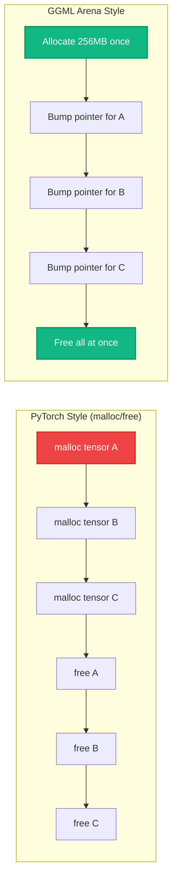
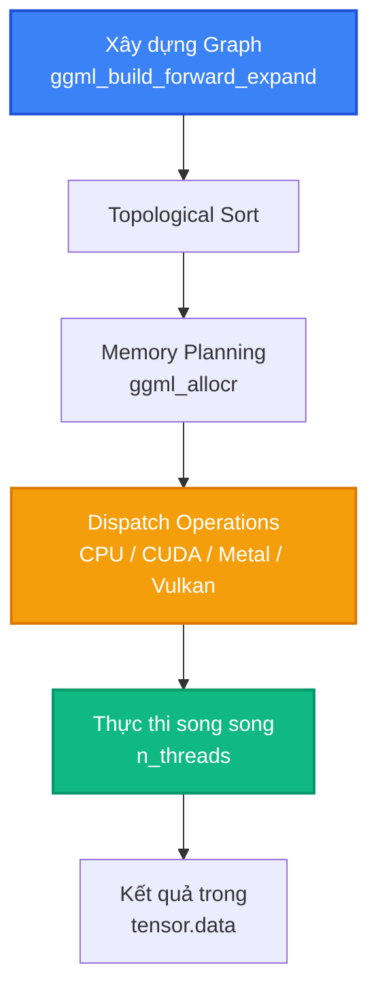

# Bài 1: GGML - Thư viện Tensor bằng C không phụ thuộc

Trước khi llama.cpp có thể inference bất kỳ mô hình nào, nó cần một nền tảng tính toán tensor. Nền tảng đó là **GGML**, một thư viện tensor viết bằng C thuần túy, không phụ thuộc bất kỳ framework ML nào. Trong bài học này, chúng ta sẽ đi sâu vào kiến trúc nội tại của GGML, từ cấu trúc tensor, hệ thống bộ nhớ arena, computation graph, đến tối ưu SIMD.

---

## 1. GGML là gì?

GGML (Georgi Gerganov's Machine Learning library) là thư viện tensor tối giản được thiết kế với triết lý:

- **Zero dependencies**: Không cần PyTorch, TensorFlow, BLAS (tùy chọn), CUDA (tùy chọn). Biên dịch được bằng bất kỳ C compiler chuẩn nào.
- **Single-header friendly**: Toàn bộ API nằm trong một file header `ggml.h` (~2200 dòng).
- **Inference-first**: Tối ưu cho forward pass (inference), hỗ trợ automatic differentiation nhưng không phải training framework.
- **Hardware-portable**: Chạy trên x86 (AVX2/AVX512), ARM (NEON/SVE), và mở rộng qua backend system đến CUDA, Metal, Vulkan.

GGML ban đầu là project riêng của Gerganov, được sử dụng trong `whisper.cpp` (speech recognition) trước khi trở thành nền tảng cho `llama.cpp`. Hiện tại, GGML là một phần của tổ chức `ggml-org` trên GitHub.

---

## 2. Cấu trúc ggml_tensor

Đơn vị cơ bản nhất trong GGML là **tensor**, được biểu diễn bằng cấu trúc `ggml_tensor` (định nghĩa trong `ggml/include/ggml.h`):

```c
struct ggml_tensor {
    enum ggml_type type;                        // Kiểu dữ liệu (F32, F16, Q4_0, ...)

    struct ggml_backend_buffer * buffer;        // Backend buffer quản lý data

    int64_t ne[GGML_MAX_DIMS];                 // Số phần tử mỗi chiều (tối đa 4 chiều)
    size_t  nb[GGML_MAX_DIMS];                 // Stride tính bằng bytes:
                                                // nb[0] = ggml_type_size(type)
                                                // nb[1] = nb[0] * (ne[0] / ggml_blck_size(type)) + padding
                                                // nb[i] = nb[i-1] * ne[i-1]

    enum ggml_op op;                           // Operation tạo ra tensor này

    int32_t op_params[GGML_MAX_OP_PARAMS / sizeof(int32_t)]; // Tham số operation

    int32_t flags;                              // Cờ (gradient, parameter, ...)

    struct ggml_tensor * src[GGML_MAX_SRC];    // Tensor nguồn (tối đa 10)

    struct ggml_tensor * view_src;             // Tensor gốc (nếu là view)
    size_t               view_offs;            // Offset của view

    void * data;                               // Con trỏ đến dữ liệu thực
    char name[GGML_MAX_NAME];                  // Tên tensor (tối đa 64 ký tự)
    void * extra;                              // Dữ liệu phụ (cho CUDA, Metal, ...)
};
```

### 2.1. Hệ thống chiều (Dimensions)

GGML hỗ trợ tối đa **4 chiều** (`GGML_MAX_DIMS = 4`), tương ứng với:

| Chiều | Ý nghĩa trong LLM | Ví dụ (Llama-7B) |
|:---|:---|:---|
| `ne[0]` | Embedding dimension | 4096 |
| `ne[1]` | Sequence length hoặc vocab size | 2048 hoặc 32000 |
| `ne[2]` | Number of heads hoặc layers | 32 |
| `ne[3]` | Batch size | 1 |

### 2.2. Stride trong bytes (nb)

Mảng `nb[]` (number of bytes) định nghĩa **stride** của tensor, cho biết cần nhảy bao nhiêu byte để di chuyển một vị trí theo từng chiều:

- `nb[0] = ggml_type_size(type)`: Kích thước một phần tử (ví dụ: F32 = 4 bytes, F16 = 2 bytes).
- `nb[1] = nb[0] * (ne[0] / ggml_blck_size(type)) + padding`: Bytes cho một hàng, bao gồm padding alignment.
- `nb[i] = nb[i-1] * ne[i-1]`: Bytes cho chiều cao hơn (tích lũy).

Công thức stride này cho phép GGML biểu diễn cả **contiguous tensors** (dữ liệu liên tục) và **transposed tensors** (hoán vị chiều) mà không cần sao chép dữ liệu.

---

## 3. Hệ thống 39 kiểu dữ liệu

GGML định nghĩa `enum ggml_type` với **39 kiểu dữ liệu** (tính đến phiên bản hiện tại), chia thành 5 nhóm:

### 3.1. Nhóm Floating Point chính xác cao

| Enum | Tên | Bits/trọng số | Kích thước block | Mô tả |
|:---|:---|:---|:---|:---|
| `GGML_TYPE_F32` | float32 | 32 | 1 | Single precision, dùng cho training và output |
| `GGML_TYPE_F64` | float64 | 64 | 1 | Double precision, hiếm khi dùng |
| `GGML_TYPE_F16` | float16 | 16 | 1 | Half precision, chuẩn cho weight storage |
| `GGML_TYPE_BF16` | bfloat16 | 16 | 1 | Brain Float 16, dynamic range lớn hơn F16 |

### 3.2. Nhóm Integer

| Enum | Tên | Bits | Mô tả |
|:---|:---|:---|:---|
| `GGML_TYPE_I8` | int8 | 8 | Integer 8-bit |
| `GGML_TYPE_I16` | int16 | 16 | Integer 16-bit |
| `GGML_TYPE_I32` | int32 | 32 | Integer 32-bit |
| `GGML_TYPE_I64` | int64 | 64 | Integer 64-bit |

### 3.3. Nhóm Block Quantization cơ bản

| Enum | Tên | Bits/trọng số | Block size | Mô tả |
|:---|:---|:---|:---|:---|
| `GGML_TYPE_Q4_0` | 4-bit symmetric | 4.50 | 32 | 1 scale (F16) + 32 x 4-bit values |
| `GGML_TYPE_Q4_1` | 4-bit asymmetric | 4.75 | 32 | 1 scale + 1 min (F16) + 32 x 4-bit |
| `GGML_TYPE_Q5_0` | 5-bit symmetric | 5.50 | 32 | 1 scale (F16) + 32 x 5-bit values |
| `GGML_TYPE_Q5_1` | 5-bit asymmetric | 5.75 | 32 | 1 scale + 1 min (F16) + 32 x 5-bit |
| `GGML_TYPE_Q8_0` | 8-bit symmetric | 8.50 | 32 | 1 scale (F16) + 32 x int8 |
| `GGML_TYPE_Q8_1` | 8-bit asymmetric | 8.75 | 32 | 1 scale + 1 sum (F16) + 32 x int8 |

### 3.4. Nhóm K-quants (Super-blocks)

| Enum | Tên | Bits/trọng số | Mô tả |
|:---|:---|:---|:---|
| `GGML_TYPE_Q2_K` | 2-bit K-quant | 2.56 | Super-block 256 values, shared scales |
| `GGML_TYPE_Q3_K` | 3-bit K-quant | 3.44 | Super-block với 6-bit sub-block scales |
| `GGML_TYPE_Q4_K` | 4-bit K-quant | 4.50 | Super-block với 6-bit sub-block scales |
| `GGML_TYPE_Q5_K` | 5-bit K-quant | 5.50 | Super-block, chất lượng gần F16 |
| `GGML_TYPE_Q6_K` | 6-bit K-quant | 6.56 | Super-block, chất lượng rất cao |
| `GGML_TYPE_Q8_K` | 8-bit K-quant | 8.50 | Super-block, gần như lossless |

### 3.5. Nhóm I-quants (Importance-based)

| Enum | Tên | Bits/trọng số | Mô tả |
|:---|:---|:---|:---|
| `GGML_TYPE_IQ2_XXS` | 2-bit IQ extra-extra-small | ~2.06 | Lookup table 2-bit, nhỏ nhất |
| `GGML_TYPE_IQ2_XS` | 2-bit IQ extra-small | ~2.31 | Lookup table 2-bit |
| `GGML_TYPE_IQ2_S` | 2-bit IQ small | ~2.50 | Lookup table 2-bit, quality cao |
| `GGML_TYPE_IQ3_XXS` | 3-bit IQ extra-extra-small | ~3.06 | Lookup table 3-bit |
| `GGML_TYPE_IQ3_S` | 3-bit IQ small | ~3.44 | Lookup table 3-bit, quality cao |
| `GGML_TYPE_IQ1_S` | 1-bit IQ small | ~1.56 | Cực kỳ nén, dùng importance matrix |
| `GGML_TYPE_IQ1_M` | 1-bit IQ medium | ~1.75 | 1-bit với importance matrix |
| `GGML_TYPE_IQ4_NL` | 4-bit IQ non-linear | ~4.50 | Non-linear mapping, quality tốt nhất 4-bit |
| `GGML_TYPE_IQ4_XS` | 4-bit IQ extra-small | ~4.25 | Non-linear compact |

---

## 4. Arena-based Memory Allocation

Khác với PyTorch (dùng `malloc`/`free` cho từng tensor), GGML sử dụng **arena allocation**, một chiến lược quản lý bộ nhớ cực kỳ hiệu quả cho inference:

### 4.1. Nguyên lý Arena Allocation

```c
// Khởi tạo: cấp phát một block bộ nhớ lớn duy nhất
struct ggml_init_params params = {
    .mem_size   = 256 * 1024 * 1024,  // 256 MB arena
    .mem_buffer = NULL,                // GGML tự malloc
    .no_alloc   = false,
};

struct ggml_context * ctx = ggml_init(params);

// Tạo tensor: cấp phát từ arena (cực nhanh, không syscall)
struct ggml_tensor * a = ggml_new_tensor_2d(ctx, GGML_TYPE_F32, 4096, 4096);
struct ggml_tensor * b = ggml_new_tensor_2d(ctx, GGML_TYPE_F32, 4096, 4096);
struct ggml_tensor * c = ggml_mul_mat(ctx, a, b);  // Kết quả cũng trong arena

// Giải phóng: free toàn bộ arena một lần
ggml_free(ctx);
```

### 4.2. Tại sao Arena Allocation tối ưu cho LLM Inference?



Lợi ích của arena allocation:

1. **Tốc độ**: Cấp phát tensor chỉ là phép cộng pointer (bump allocator), nhanh hơn `malloc` hàng nghìn lần.
2. **Không memory fragmentation**: Toàn bộ tensor nằm trong một block liên tục, không bị phân mảnh.
3. **Cache-friendly**: Các tensor kề nhau trong bộ nhớ, tối ưu CPU cache line utilization.
4. **Giải phóng đơn giản**: Một lệnh `ggml_free()` giải phóng toàn bộ, không lo memory leak.
5. **Phù hợp inference lifecycle**: Mỗi inference request tạo một context, tính toán xong giải phóng tất cả.

---

## 5. Computation Graph (ggml_cgraph)

GGML sử dụng **computation graph** (đồ thị tính toán) để biểu diễn và thực thi chuỗi phép tính:

### 5.1. Xây dựng Graph

Mỗi phép tính tensor (`ggml_add`, `ggml_mul_mat`, `ggml_softmax`, ...) tạo ra một tensor mới và tự động thêm node vào computation graph:

```c
// Xây dựng hàm f(x) = softmax(W * x + b)
struct ggml_tensor * x = ggml_new_tensor_2d(ctx, GGML_TYPE_F32, 4096, 1);
struct ggml_tensor * W = ggml_new_tensor_2d(ctx, GGML_TYPE_F32, 4096, 4096);
struct ggml_tensor * b = ggml_new_tensor_1d(ctx, GGML_TYPE_F32, 4096);

struct ggml_tensor * wx  = ggml_mul_mat(ctx, W, x);    // Matrix multiplication
struct ggml_tensor * wxb = ggml_add(ctx, wx, b);       // Bias addition
struct ggml_tensor * out = ggml_soft_max(ctx, wxb);    // Softmax

// Đóng gói thành computation graph
struct ggml_cgraph * gf = ggml_new_graph(ctx);
ggml_build_forward_expand(gf, out);
```

### 5.2. Thực thi Graph

```c
// Thực thi toàn bộ graph với n_threads CPU threads
ggml_graph_compute_with_ctx(ctx, gf, n_threads);
```

Khi `ggml_graph_compute_with_ctx()` được gọi, GGML:

1. **Topological sort**: Sắp xếp các node theo thứ tự phụ thuộc.
2. **Memory planning**: Tính toán bộ nhớ cần thiết cho mỗi intermediate tensor.
3. **Dispatch operations**: Gọi hàm tính toán tương ứng cho mỗi node (có thể dispatch đến CPU, CUDA, Metal tùy backend).
4. **Thread parallelism**: Phân chia công việc cho `n_threads` CPU threads.



---

## 6. SIMD Optimization

**SIMD** (Single Instruction, Multiple Data) là tập lệnh cho phép CPU xử lý nhiều số cùng lúc trong một clock cycle. GGML tận dụng SIMD tối đa cho các phép tính tensor:

### 6.1. Các tập lệnh SIMD được hỗ trợ

| Kiến trúc | Tập lệnh | Vector width | FP32 ops/cycle | Sử dụng cho |
|:---|:---|:---|:---|:---|
| x86 | SSE | 128-bit | 4 | Legacy CPU |
| x86 | **AVX2** | 256-bit | 8 | Desktop/laptop modern |
| x86 | **AVX512** | 512-bit | 16 | Server (Xeon, Threadripper) |
| ARM | **NEON** | 128-bit | 4 | Raspberry Pi, điện thoại, Apple Silicon |
| ARM | **SVE/SVE2** | scalable | varies | ARM server (Graviton3+) |

### 6.2. Dequantization với SIMD

Phép tính phổ biến nhất trong inference là **dequantize-and-multiply**: đọc block trọng số quantized, giải nén về FP32, rồi nhân với activation vector. GGML implement phép này bằng SIMD:

```c
// Ví dụ: Dequantize Q4_0 block (32 values) bằng AVX2
// Mỗi block Q4_0 gồm: 1 scale (F16) + 16 bytes (mỗi byte chứa 2 giá trị 4-bit)

// AVX2: xử lý 8 float cùng lúc (256-bit register)
__m256 scale_vec = _mm256_set1_ps(scale);     // Broadcast scale vào 8 lanes
__m256i packed   = _mm256_loadu_si256(data);  // Load 16 bytes = 32 giá trị 4-bit

// Unpack 4-bit values thành 8-bit
__m256i low  = _mm256_and_si256(packed, mask);    // 4-bit thấp
__m256i high = _mm256_srli_epi16(packed, 4);      // 4-bit cao

// Convert sang float và nhân với scale
__m256 f_low  = _mm256_mul_ps(_mm256_cvtepi32_ps(low), scale_vec);
__m256 f_high = _mm256_mul_ps(_mm256_cvtepi32_ps(high), scale_vec);

// f_low và f_high chứa 16 float đã dequantize mỗi cái
// Dot product với activation vector cho kết quả cuối cùng
```

Với AVX2, GGML có thể dequantize và nhân 32 giá trị Q4_0 trong vài clock cycles, nhanh hơn ~8x so với xử lý từng giá trị một.

---

## 7. Memory Allocator (ggml_allocr)

Khi computation graph có nhiều intermediate tensors (attention scores, FFN activations, ...), việc quản lý bộ nhớ trở nên phức tạp. GGML cung cấp `ggml_allocr` (allocator) để tối ưu hóa việc sử dụng bộ nhớ:

```c
// Tạo allocator từ một buffer cố định
struct ggml_backend_buffer * buf = ggml_backend_alloc_buffer(backend, 512 * 1024 * 1024);
struct ggml_allocr * alloc = ggml_allocr_new_from_buffer(buf);

// Allocator tự động tái sử dụng bộ nhớ của intermediate tensors
// đã không còn cần thiết (dead tensor detection)
ggml_allocr_alloc(alloc, tensor_a);  // Allocate tensor A
ggml_allocr_alloc(alloc, tensor_b);  // Allocate tensor B
ggml_allocr_free(alloc, tensor_a);   // Free A (bộ nhớ có thể tái sử dụng)
ggml_allocr_alloc(alloc, tensor_c);  // Allocate C (có thể dùng lại vùng nhớ của A)
```

Chiến lược này giúp giảm đáng kể peak memory usage so với việc giữ tất cả intermediate tensors cho đến cuối computation.

---

## 💡 Đúc kết Bài 1

GGML là nền tảng kiến trúc cho phép llama.cpp đạt hiệu năng cao trên CPU:

1. **Arena allocation** loại bỏ overhead của malloc/free, phù hợp với lifecycle ngắn của inference request.
2. **Computation graph** cho phép GGML tự động tối ưu memory planning và thread dispatch.
3. **SIMD optimization** tận dụng tối đa khả năng vectorization của CPU hiện đại.
4. **Hệ thống 39 kiểu dữ liệu** cung cấp bộ công cụ quantization phong phú nhất trong các framework inference.

Trong bài tiếp theo, chúng ta sẽ tìm hiểu cách GGML đóng gói tất cả tensor và metadata vào định dạng file GGUF, cầu nối giữa model weights và inference engine.
