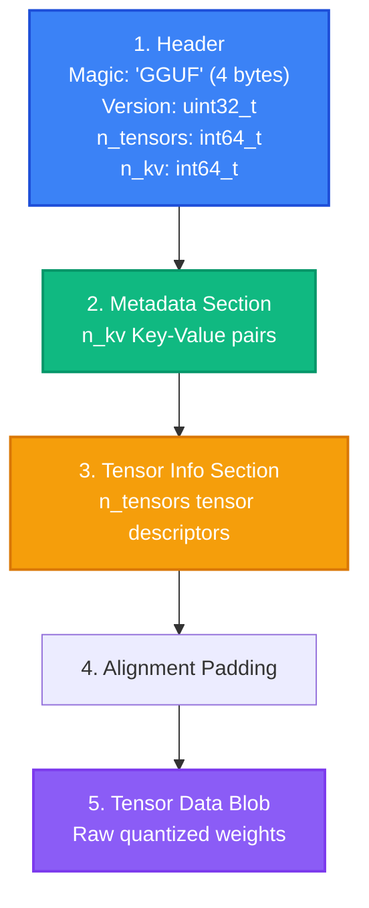

# Bài 2: Định dạng GGUF - Cấu trúc nhị phân và Thiết kế

Nếu GGML là "bộ não tính toán" của llama.cpp, thì **GGUF** (GGML Unified Format) là "bộ xương lưu trữ", định dạng file nhị phân chứa toàn bộ trọng số mô hình và metadata cần thiết để inference. Trong bài này, chúng ta sẽ giải phẫu cấu trúc file GGUF, hiểu tại sao nó được thiết kế như vậy, và học cách lập trình đọc/ghi GGUF bằng Python và C.

---

## 1. Tại sao cần GGUF?

Trước GGUF, llama.cpp sử dụng định dạng GGML (cũng tên GGML nhưng khác với thư viện). Định dạng cũ có nhiều hạn chế:

- Không hỗ trợ metadata mở rộng (không lưu được tokenizer config, chat template, ...).
- Alignment không chuẩn cho SIMD.
- Không có versioning, mỗi lần thay đổi format phải đổi tên (GGML v1, v2, v3).
- Không hỗ trợ multi-file splitting.

**GGUF** (giới thiệu tháng 8/2023) giải quyết tất cả các vấn đề trên bằng thiết kế extensible, versioned, và SIMD-aligned.

---

## 2. Cấu trúc file GGUF

Theo documentation trong `ggml/include/gguf.h`, một file GGUF có cấu trúc như sau:



### 2.1. Header (16 bytes cố định)

```
Offset  Size   Field          Value
0       4      Magic          "GGUF" (0x46554747)
4       4      Version        3 (uint32_t, hiện tại là v3)
8       8      n_tensors      Số lượng tensor trong file (int64_t)
16      8      n_kv           Số lượng metadata key-value pairs (int64_t)
```

### 2.2. Metadata Section (Key-Value Pairs)

Sau header là `n_kv` cặp key-value, mỗi cặp có cấu trúc:

```
Field          Size          Mô tả
key_len        uint64_t      Độ dài key string (không bao gồm null terminator)
key            key_len bytes Key string (UTF-8)
value_type     int32_t       Kiểu giá trị (gguf_type enum)
value          variable      Giá trị (binary encoding theo type)
```

Hệ thống `gguf_type` hỗ trợ 13 kiểu dữ liệu:

| Enum | Giá trị | Kiểu | Kích thước |
|:---|:---|:---|:---|
| `GGUF_TYPE_UINT8` | 0 | Unsigned 8-bit | 1 byte |
| `GGUF_TYPE_INT8` | 1 | Signed 8-bit | 1 byte |
| `GGUF_TYPE_UINT16` | 2 | Unsigned 16-bit | 2 bytes |
| `GGUF_TYPE_INT16` | 3 | Signed 16-bit | 2 bytes |
| `GGUF_TYPE_UINT32` | 4 | Unsigned 32-bit | 4 bytes |
| `GGUF_TYPE_INT32` | 5 | Signed 32-bit | 4 bytes |
| `GGUF_TYPE_FLOAT32` | 6 | Float 32-bit | 4 bytes |
| `GGUF_TYPE_BOOL` | 7 | Boolean | 1 byte |
| `GGUF_TYPE_STRING` | 8 | String (uint64_t len + data) | Variable |
| `GGUF_TYPE_ARRAY` | 9 | Array (type + count + elements) | Variable |
| `GGUF_TYPE_UINT64` | 10 | Unsigned 64-bit | 8 bytes |
| `GGUF_TYPE_INT64` | 11 | Signed 64-bit | 8 bytes |
| `GGUF_TYPE_FLOAT64` | 12 | Double 64-bit | 8 bytes |

### 2.3. Các metadata keys phổ biến

Một file GGUF cho mô hình LLM thường chứa các metadata sau:

```
general.architecture          = "llama"          (STRING)
general.name                  = "Llama-3-8B"     (STRING)
general.file_type             = 15                (UINT32, GGUF quant type)
general.quantization_version  = 2                 (UINT32)
llama.context_length          = 8192              (UINT32)
llama.embedding_length        = 4096              (UINT32)
llama.block_count             = 32                (UINT32)
llama.attention.head_count    = 32                (UINT32)
llama.attention.head_count_kv = 8                 (UINT32, cho GQA)
llama.rope.freq_base          = 500000.0          (FLOAT32)
tokenizer.ggml.tokens         = ["<s>", ...]      (ARRAY of STRING)
tokenizer.ggml.token_type     = [1, 3, ...]       (ARRAY of INT32)
tokenizer.chat_template       = ""       (STRING, Jinja2 template)
```

### 2.4. Tensor Info Section

Sau metadata, file chứa `n_tensors` tensor descriptors, mỗi descriptor:

```
Field          Size           Mô tả
name_len       uint64_t       Độ dài tên tensor
name           name_len bytes Tên tensor (ví dụ: "blk.0.attn_q.weight")
n_dims         uint32_t       Số chiều (1, 2, 3, hoặc 4)
dims           n_dims * int64_t Kích thước mỗi chiều
type           int32_t        Kiểu ggml_type (F32=0, F16=1, Q4_0=2, ...)
offset         uint64_t       Offset trong tensor data blob (bytes)
```

### 2.5. Alignment Padding

Sau tensor info, file được **pad** đến bội số của `GGUF_DEFAULT_ALIGNMENT` (32 bytes):

$$\text{padding} = (\text{alignment} - (\text{current\_offset} \mod \text{alignment})) \mod \text{alignment}$$

Giá trị `general.alignment` trong metadata có thể override default 32 bytes.

### 2.6. Tensor Data Blob

Phần cuối cùng là **tensor data blob**, một khối binary liên tục chứa tất cả trọng số đã quantize. Mỗi tensor nằm tại offset được chỉ định trong tensor info section.

---

## 3. 32-byte Alignment: Tại sao quan trọng?

Con số 32 không phải ngẫu nhiên. Nó xuất phát từ yêu cầu của **AVX2 SIMD**:

- AVX2 sử dụng thanh ghi 256-bit = 32 bytes.
- Khi load dữ liệu từ bộ nhớ vào thanh ghi AVX2 (`_mm256_load_si256`), địa chỉ phải **aligned 32 bytes** để đạt hiệu năng tối đa.
- Nếu không aligned, CPU phải dùng `_mm256_loadu_si256` (unaligned load), chậm hơn trên một số kiến trúc cũ.

Với 32-byte alignment, khi llama.cpp mmap file GGUF và đọc tensor data, mỗi block quantization (thường 32 elements) sẽ nằm tại địa chỉ aligned, cho phép SIMD load cực nhanh.

---

## 4. Lập trình với GGUF trong Python

llama.cpp cung cấp thư viện Python `gguf-py` (nằm trong `gguf-py/gguf/`) để đọc và ghi file GGUF.

### 4.1. Đọc file GGUF

```python
from gguf import GGUFReader

reader = GGUFReader("model.gguf")

# Đọc metadata
for field in reader.fields.values():
    print(f"{field.name}: {field.parts[field.data[0]]}")

# Đọc tensor info
for tensor in reader.tensors:
    print(f"{tensor.name}: shape={tensor.shape}, type={tensor.tensor_type}, offset={tensor.data_offset}")
```

### 4.2. Ghi file GGUF

```python
from gguf import GGUFWriter
import numpy as np

writer = GGUFWriter("output.gguf", arch="llama")

# Thêm metadata
writer.add_string("general.name", "My Custom Model")
writer.add_uint32("llama.context_length", 4096)
writer.add_uint32("llama.embedding_length", 4096)
writer.add_uint32("llama.block_count", 32)

# Thêm tensor (FP16)
weight = np.random.randn(4096, 4096).astype(np.float16)
writer.add_tensor("blk.0.attn_q.weight", weight)

# Ghi file
writer.write_header_to_file()
writer.write_kv_data_to_file()
writer.write_tensors_to_file()
writer.close()
```

### 4.3. Đọc GGUF thuần bằng struct module

Để hiểu sâu hơn, chúng ta có thể đọc GGUF từ đầu mà không dùng thư viện:

```python
import struct

def read_gguf_header(filepath):
    """Đọc và parse header của file GGUF"""
    with open(filepath, 'rb') as f:
        # Đọc magic (4 bytes)
        magic = f.read(4)
        assert magic == b'GGUF', f"Not a GGUF file: {magic}"

        # Đọc version (uint32_t, little-endian)
        version = struct.unpack('<I', f.read(4))[0]
        print(f"GGUF Version: {version}")

        # Đọc số lượng tensors (int64_t)
        n_tensors = struct.unpack('<q', f.read(8))[0]
        print(f"Number of tensors: {n_tensors}")

        # Đọc số lượng KV pairs (int64_t)
        n_kv = struct.unpack('<q', f.read(8))[0]
        print(f"Number of KV pairs: {n_kv}")

        return version, n_tensors, n_kv

# Sử dụng
version, n_tensors, n_kv = read_gguf_header("llama-3-8b-q4_k_m.gguf")
```

---

## 5. Lập trình với GGUF trong C

Trong mã nguồn llama.cpp, GGUF được đọc qua API trong `gguf.h`:

```c
#include "gguf.h"
#include "ggml.h"

// Đọc file GGUF
struct ggml_context * ctx = NULL;
struct gguf_init_params params = {
    .no_alloc = false,
    .ctx = &ctx,  // Tự động tạo ggml_context cho tensor data
};

struct gguf_context * gguf_ctx = gguf_init_from_file("model.gguf", params);

// Đọc metadata
int n_kv = gguf_get_n_kv(gguf_ctx);
for (int i = 0; i < n_kv; i++) {
    const char * key = gguf_get_key(gguf_ctx, i);
    enum gguf_type type = gguf_get_kv_type(gguf_ctx, i);
    if (type == GGUF_TYPE_STRING) {
        const char * val = gguf_get_val_str(gguf_ctx, i);
        printf("%s = %s\n", key, val);
    }
}

// Đọc tensor info
int n_tensors = gguf_get_n_tensors(gguf_ctx);
for (int i = 0; i < n_tensors; i++) {
    const char * name = gguf_get_tensor_name(gguf_ctx, i);
    enum ggml_type type = gguf_get_tensor_type(gguf_ctx, i);
    printf("Tensor %d: %s (type=%d)\n", i, name, type);
}

// Giải phóng
gguf_free(gguf_ctx);
ggml_free(ctx);
```

---

## 6. Version History và Compatibility

| Version | Thay đổi chính |
|:---|:---|
| GGUF v1 | Phiên bản đầu, thiếu một số metadata types |
| GGUF v2 | Thêm UINT64, INT64, FLOAT64 types |
| GGUF v3 | Thêm IQ quant types, TQ ternary types, cải thiện alignment |

llama.cpp hiện tại chỉ hỗ trợ đọc GGUF v3. Các file GGUF v1/v2 cần được convert lại.

---

## 💡 Đúc kết Bài 2

GGUF là một định dạng file được thiết kế **kỹ lưỡng** cho mục đích inference LLM:

1. **Extensible metadata** cho phép lưu mọi thông tin từ architecture config đến tokenizer và chat template.
2. **32-byte alignment** tối ưu cho SIMD vectorization trên CPU.
3. **Self-contained**: Một file GGUF chứa đủ mọi thứ cần thiết để inference, không cần file phụ.
4. **Versioned**: Dễ dàng mở rộng mà không phá vỡ backward compatibility.

Trong bài tiếp theo, chúng ta sẽ đi sâu vào các giải thuật quantization mà GGUF hỗ trợ, hiểu toán học đằng sau việc nén trọng số từ 16-bit xuống 4-bit mà vẫn giữ chất lượng.
