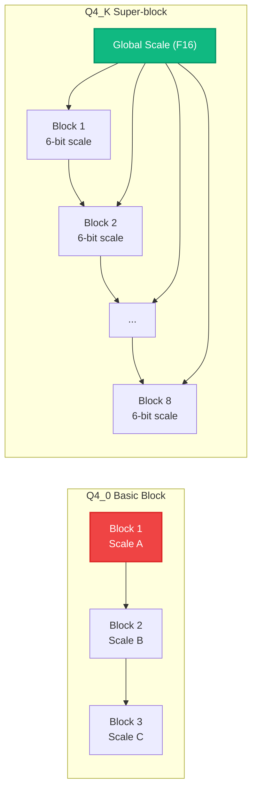

# Bài 3: Giải thuật Quantization - Từ Lý thuyết đến Hiện thực

**Quantization** (lượng tử hóa) là kỹ thuật cốt lõi giúp llama.cpp chạy được mô hình lớn trên phần cứng giới hạn. Bằng cách giảm độ chính xác của trọng số từ 16-bit xuống 4-bit hoặc thấp hơn, ta giảm 4 lần bộ nhớ và tăng tốc inference trên CPU. Nhưng quantization không đơn giản là "làm tròn số", mà là một bài toán tối ưu hóa giữa **kích thước**, **tốc độ** và **chất lượng**.

---

## 1. Tại sao cần Quantization? Phân tích Memory Bandwidth Bottleneck

Như đã phân tích ở Bài 0, LLM inference (đặc biệt giai đoạn decode) là **memory-bound**: tốc độ bị giới hạn bởi băng thông bộ nhớ, không phải FLOPS.

Xét mô hình Llama-3-8B với 8 tỷ tham số:

| Độ chính xác | Bits/trọng số | Kích thước | Tốc độ trên DDR5 (50 GB/s) |
|:---|:---|:---|:---|
| FP32 | 32 | 32 GB | ~1.6 tok/s |
| FP16 | 16 | 16 GB | ~3.1 tok/s |
| Q8_0 | 8.5 | 8.5 GB | ~5.9 tok/s |
| Q5_K_M | 5.5 | 5.7 GB | ~8.8 tok/s |
| **Q4_K_M** | **4.8** | **4.9 GB** | **~10.2 tok/s** |
| Q3_K_M | 3.9 | 4.0 GB | ~12.5 tok/s |
| Q2_K | 2.6 | 2.7 GB | ~18.5 tok/s |

Công thức cơ bản:

$$\text{Throughput (tok/s)} \approx \frac{\text{Memory Bandwidth (GB/s)}}{\text{Model Size (GB)}}$$

Quantization giảm mẫu số, tăng throughput. Câu hỏi là: **nén bao nhiêu mà chất lượng vẫn chấp nhận được?**

---

## 2. Block Quantization cơ bản

### 2.1. Q4_0: 4-bit Symmetric Quantization

Đây là phương pháp đơn giản nhất. Mỗi block 32 giá trị FP16 được nén thành:

- **1 scale** (F16, 2 bytes): Hệ số tỷ lệ
- **32 giá trị 4-bit** (16 bytes): Trọng số đã quantize

Tổng: 18 bytes cho 32 giá trị = **4.5 bits/trọng số**.

**Công thức Quantize:**
$$\text{scale} = \frac{\max(|x_i|)}{7}, \quad q_i = \text{round}\left(\frac{x_i}{\text{scale}}\right), \quad q_i \in [-8, 7]$$

**Công thức Dequantize:**
$$\hat{x}_i = q_i \times \text{scale}$$

Trong mã nguồn (`ggml-quants.c`):

```c
// Block Q4_0: 18 bytes cho 32 giá trị
typedef struct {
    ggml_fp16_t d;      // scale (F16)
    uint8_t qs[16];      // 32 giá trị 4-bit (mỗi byte chứa 2 giá trị)
} block_q4_0;

// Dequantize một block
inline void dequantize_row_q4_0(const block_q4_0 * x, float * y, int64_t k) {
    for (int i = 0; i < k / QK4_0; i++) {
        const float d = GGML_FP16_TO_FP32(x[i].d);
        for (int j = 0; j < QK4_0 / 2; j++) {
            const int x0 = (x[i].qs[j] & 0x0F) - 8;  // 4-bit thấp, shift về [-8, 7]
            const int x1 = (x[i].qs[j] >> 4) - 8;      // 4-bit cao
            y[i * QK4_0 + j]            = x0 * d;
            y[i * QK4_0 + j + QK4_0/2]  = x1 * d;
        }
    }
}
```

### 2.2. Q5_0 và Q8_0

Tương tự Q4_0 nhưng với nhiều bit hơn:

| Loại | Bits/weight | Block size | Scale | Quantized values |
|:---|:---|:---|:---|:---|
| Q4_0 | 4.50 | 32 | F16 | 4-bit signed [-8, 7] |
| Q5_0 | 5.50 | 32 | F16 | 5-bit signed [-16, 15] |
| Q8_0 | 8.50 | 32 | F16 | 8-bit signed [-128, 127] |

Q8_0 thường dùng cho **activations** (dữ liệu đầu vào) vì giữ chất lượng cao, trong khi Q4_0/Q5_0 dùng cho **weights** (trọng số) để tiết kiệm bộ nhớ.

### 2.3. Q4_1 và Q5_1: Asymmetric Quantization

Thêm một trường **minimum** (min) vào block, cho phép biểu diễn chính xác hơn khi phân phối trọng số không đối xứng quanh 0:

$$\hat{x}_i = q_i \times \text{scale} + \text{min}$$

Đổi lại, kích thước block tăng thêm 2 bytes (1 F16 cho min).

---

## 3. K-quants: Super-block Quantization

K-quants (giới thiệu bởi Iwan Kawrakow) là bước đột phá về chất lượng quantization. Thay vì mỗi block 32 giá trị có scale riêng, K-quants gom nhiều block thành **super-block** (256 giá trị) và chia sẻ scale giữa các sub-blocks.

### 3.1. Q4_K: Super-block Structure

```
Super-block Q4_K (256 values):
├── d (F16)           : Global scale
├── dmin (F16)        : Global minimum scale
├── scales[12]        : 12 bytes chứa 8 sub-block scales (6-bit mỗi cái)
├── mins[12]          : (shared với scales) 8 sub-block mins (6-bit mỗi cái)
└── qs[128]           : 256 giá trị 4-bit (128 bytes)
```

Tổng: 2 + 2 + 12 + 128 = **144 bytes** cho 256 giá trị = **4.50 bits/trọng số**.

### 3.2. Tại sao K-quants tốt hơn Basic Quants?



Lợi ích:

1. **Scale granularity cao hơn**: Mỗi super-block có 8 sub-block scales (6-bit) + 1 global scale (F16), cho phép biểu diễn phân phối trọng số chính xác hơn.
2. **Overhead thấp hơn**: 8 sub-blocks chia sẻ 1 global scale, giảm overhead so với 8 block Q4_0 độc lập.
3. **Min/Scale separation**: Separate scales cho giá trị dương và âm, giảm quantization error cho phân phối không đối xứng.

### 3.3. Q4_K_S vs Q4_K_M

llama.cpp cung cấp hai biến thể của Q4_K:

| Biến thể | Bits/weight | Strategy | Use case |
|:---|:---|:---|:---|
| Q4_K_S | 4.59 | Quantize tất cả layers giống nhau | Kích thước nhỏ nhất |
| **Q4_K_M** | 4.85 | Giữ F16 cho attention layers, quantize FFN layers | **Chất lượng/tỉ lệ tốt nhất** |

Q4_K_M sử dụng **mixed precision strategy**: attention layers nhạy cảm với quantization error hơn FFN layers, nên giữ chúng ở FP16 hoặc Q6_K.

---

## 4. I-quants: Importance-based Quantization

I-quants (Importance quants, giới thiệu 2024) là thế hệ quantization mới nhất, sử dụng **importance matrix** (imatrix) để phân bổ bit thông minh hơn.

### 4.1. Ý tưởng cốt lõi

Không phải tất cả trọng số đều quan trọng như nhau. Một số trọng số có ảnh hưởng lớn đến output, trong khi số khác ít quan trọng hơn. I-quants sử dụng **calibration data** để:

1. Chạy inference trên dữ liệu mẫu, đo **activation magnitude** của mỗi neuron.
2. Xây dựng **importance matrix**: trọng số nào có activation lớn thì quan trọng hơn.
3. Phân bổ bit cho mỗi trọng số dựa trên importance: trọng số quan trọng được nhiều bit hơn, trọng số ít quan trọng bị nén mạnh hơn.

### 4.2. Lookup Table Implementation

Thay vì lưu trọng số dưới dạng (scale + quantized_value), I-quants sử dụng **pre-computed lookup tables**:

```python
# Ý tưởng: Tạo bảng 256 giá trị tối ưu cho phân phối trọng số
lookup_table = compute_optimal_quants(calibration_data, n_bits=2)
# lookup_table có 256 entries (2^8 possible 8-bit indices)

# Khi encode:
index = find_closest_entry(weight, lookup_table)  # 8-bit index
# Lưu: index (1 byte) thay vì weight (2 bytes F16)

# Khi decode:
reconstructed_weight = lookup_table[index]  # Tra cứu O(1)
```

### 4.3. Các biến thể I-quant

| Loại | Bits/weight | Đặc điểm |
|:---|:---|:---|
| IQ2_XXS | ~2.06 | Lookup table cực nhỏ, nén mạnh nhất |
| IQ2_XS | ~2.31 | Nhỏ, dùng cho mô hình rất lớn trên RAM giới hạn |
| IQ2_S | ~2.50 | Chất lượng tốt ở 2-bit |
| IQ3_XXS | ~3.06 | 3-bit nhỏ |
| IQ3_S | ~3.44 | 3-bit chất lượng cao |
| IQ4_NL | ~4.50 | Non-linear mapping, **chất lượng tốt nhất ở 4-bit** |
| IQ4_XS | ~4.25 | Compact non-linear |

IQ4_NL đặc biệt đáng chú ý: nó đạt chất lượng **tương đương Q5_K** nhưng chỉ dùng 4.5 bits/weight, nhờ non-linear mapping tối ưu hơn linear quantization.

---

## 5. TQ-quants: Ternary Quantization

TQ1_0 và TQ2_0 là các phương pháp quantization **ternary** (3 giá trị: -1, 0, +1) mới nhất:

| Loại | Bits/weight | Đặc điểm |
|:---|:---|:---|
| TQ1_0 | ~1.69 | 1-bit ternary, nén cực mạnh |
| TQ2_0 | ~2.00 | 2-bit ternary, chất lượng cao hơn |

Ternary weights đặc biệt hiệu quả vì nhân với -1, 0, +1 chỉ cần phép cộng/trừ, không cần phép nhân.

---

## 6. Toán học Quantization Error

### 6.1. Mean Squared Error (MSE)

Với uniform quantization step $\Delta$:

$$MSE = \frac{\Delta^2}{12}$$

### 6.2. Signal-to-Quantization-Noise Ratio (SQNR)

$$SQNR = 6.02 \cdot b + 1.76 \text{ dB}$$

Trong đó $b$ là số bits. Mỗi bit thêm vào tăng SQNR thêm ~6 dB.

| Quant | Bits | SQNR lý thuyết |
|:---|:---|:---|
| Q8_0 | 8 | 49.9 dB |
| Q5_K | 5.5 | 34.9 dB |
| Q4_K | 4.5 | 28.9 dB |
| Q3_K | 3.4 | 22.2 dB |
| Q2_K | 2.6 | 17.4 dB |

### 6.3. Perplexity Degradation

Thực nghiệm trên Llama-3-8B (WikiText-2):

| Quant | PPL | Δ PPL so với FP16 |
|:---|:---|:---|
| FP16 | 6.14 | 0.00 |
| Q8_0 | 6.15 | +0.01 |
| Q6_K | 6.17 | +0.03 |
| Q5_K_M | 6.20 | +0.06 |
| Q4_K_M | 6.35 | +0.21 |
| Q3_K_M | 6.72 | +0.58 |
| Q2_K | 7.89 | +1.75 |

**Q4_K_M** thường được coi là **sweet spot**: chỉ tăng PPL 3.4% so với FP16 nhưng giảm 70% kích thước.

---

## 7. Quy trình Quantization trong llama.cpp

```bash
# Bước 1: Convert HuggingFace model sang GGUF FP16
python convert_hf_to_gguf.py /path/to/model --outfile model-f16.gguf

# Bước 2: Quantize từ FP16 xuống Q4_K_M
./llama-quantize model-f16.gguf model-q4_k_m.gguf Q4_K_M

# Bước 2 (nâng cao): Quantize với importance matrix
./llama-imatrix -m model-f16.gguf -f calibration_data.txt -o imatrix.dat
./llama-quantize --imatrix imatrix.dat model-f16.gguf model-iq4_nl.gguf IQ4_NL
```

---

## 💡 Đúc kết Bài 3

Hệ thống quantization của llama.cpp là **phong phú nhất** trong các framework inference, với hơn 30 loại quantization trải qua 3 thế hệ:

1. **Basic Quants** (Q4_0-Q8_0): Đơn giản, nhanh, dễ hiểu.
2. **K-quants** (Q2_K-Q8_K): Super-blocks, chất lượng vượt trội cùng bits.
3. **I-quants** (IQ2-IQ4): Importance-based, tối ưu bit allocation bằng calibration data.

**Q4_K_M** là lựa chọn mặc định cho hầu hết use cases, cân bằng hoàn hảo giữa kích thước, tốc độ và chất lượng.
