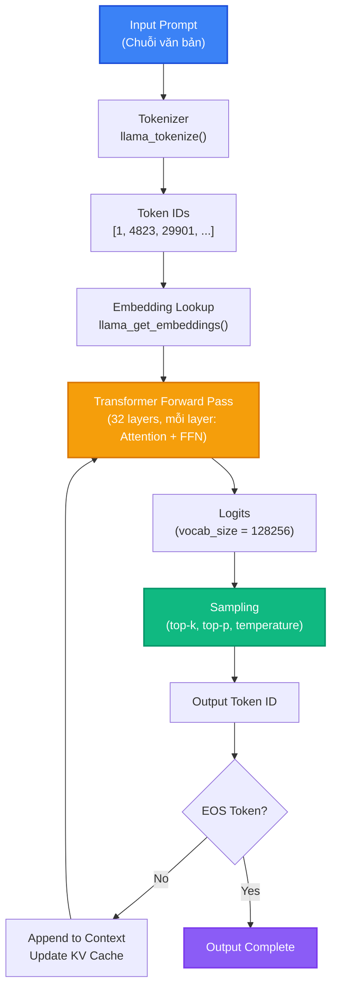

# Bài 4: Kiến trúc Inference Engine của llama.cpp

Sau khi hiểu GGML (Bài 1), GGUF (Bài 2) và Quantization (Bài 3), chúng ta đã có đủ nền tảng để đi sâu vào **inference engine** của llama.cpp. Bài này phân tích toàn bộ pipeline từ khi nhận input prompt đến khi sinh ra output token, bao gồm context management, KV Cache, sampling và batch processing.

---

## 1. Tổng quan Inference Pipeline



Inference diễn ra qua hai giai đoạn:

1. **Prefill (Prompt Processing)**: Xử lý toàn bộ prompt cùng lúc, build KV Cache cho tất cả prompt tokens.
2. **Decode (Token Generation)**: Sinh từng token một, mỗi step chỉ tính toán cho 1 token mới (memory-bound).

---

## 2. Context Creation (llama_context)

`llama_context` là đối tượng trung tâm quản lý trạng thái inference. Được tạo từ `llama_model` và `llama_context_params`:

```c
struct llama_context_params params = llama_context_default_params();
params.n_ctx      = 4096;     // Context window size
params.n_batch    = 2048;     // Max tokens per batch (prefill)
params.n_threads  = 8;        // CPU threads cho inference
params.n_gpu_layers = 33;     // Số layers offload lên GPU (-1 = tất cả)
params.type_k     = GGML_TYPE_F16;  // KV Cache key type
params.type_v     = GGML_TYPE_F16;  // KV Cache value type

struct llama_context * ctx = llama_init_from_model(model, params);
```

`llama_context` quản lý:
- **KV Cache**: Lưu trữ key/value vectors cho tất cả previous tokens.
- **Computation buffers**: Bộ nhớ tạm cho intermediate tensors.
- **Thread pool**: CPU thread pool cho parallel computation.
- **Backend buffers**: Bộ nhớ trên GPU (nếu offloading).

---

## 3. KV Cache Implementation

**KV Cache** là cấu trúc dữ liệu quan trọng nhất trong LLM inference. Nó lưu trữ key và value vectors của tất cả previous tokens để tránh tính toán lại:

### 3.1. Tại sao cần KV Cache?

Trong self-attention, mỗi token mới cần attention scores với **tất cả** previous tokens:

$$\text{Attention}(Q, K, V) = \text{softmax}\left(\frac{QK^T}{\sqrt{d_k}}\right)V$$

Không có KV Cache: Mỗi step phải tính lại K và V cho tất cả previous tokens (O(n^2) tổng chi phí).
Có KV Cache: Chỉ tính K và V cho token mới, append vào cache (O(n) tổng chi phí).

### 3.2. Bộ nhớ KV Cache

$$\text{KV Cache Size} = 2 \times n_{\text{layers}} \times n_{\text{kv\_heads}} \times d_{\text{head}} \times n_{\text{ctx}} \times \text{sizeof(type)}$$

Ví dụ Llama-3-8B (GQA, 32 layers, 8 KV heads, 128 head dim):

| KV Type | Context 4K | Context 8K | Context 32K |
|:---|:---|:---|:---|
| FP16 | 1.0 GB | 2.0 GB | 8.0 GB |
| Q8_0 | 0.53 GB | 1.07 GB | 4.25 GB |
| Q4_0 | 0.28 GB | 0.56 GB | 2.25 GB |

### 3.3. Sliding Window Attention

Một số mô hình (Mistral, Qwen) sử dụng **sliding window attention**, chỉ attend đến $W$ tokens gần nhất:

```c
params.n_ctx = 4096;  // Full context
// Mistral: sliding_window = 4096
// Chỉ giữ 4096 tokens gần nhất trong KV Cache
// Tokens cũ hơn bị evict (xóa khỏi cache)
```

---

## 4. Token Sampling

Sau khi model output logits (một vector vocab_size), ta cần **sample** ra token tiếp theo:

### 4.1. Temperature

$$P(x_i) = \frac{\exp(x_i / T)}{\sum_j \exp(x_j / T)}$$

- $T = 1.0$: Phân phối gốc (softmax chuẩn).
- $T < 1.0$: Sharp hơn, thiên về token có xác suất cao (greedy khi $T \to 0$).
- $T > 1.0$: Flat hơn, đa dạng hơn.

### 4.2. Top-K Sampling

Chỉ giữ lại $K$ tokens có logit cao nhất, zero-out phần còn lại:

```c
llama_sampler_chain_add(sampler, llama_sampler_init_top_k(40));
```

### 4.3. Top-P (Nucleus) Sampling

Giữ lại tập tokens nhỏ nhất có tổng xác suất $\geq p$:

```c
llama_sampler_chain_add(sampler, llama_sampler_init_top_p(0.95f, 1));
```

### 4.4. Min-P Sampling

Phương pháp mới (2024), giữ tokens có $P(x_i) \geq p \times P_{\max}$:

```c
llama_sampler_chain_add(sampler, llama_sampler_init_min_p(0.05f, 1));
```

### 4.5. Sampling Chain

llama.cpp kết hợp nhiều samplers thành một chuỗi:

```c
struct llama_sampler * sampler = llama_sampler_chain_init();
llama_sampler_chain_add(sampler, llama_sampler_init_penalties(64, 1.1f, 0.0f, 0.0f));
llama_sampler_chain_add(sampler, llama_sampler_init_top_k(40));
llama_sampler_chain_add(sampler, llama_sampler_init_top_p(0.95f, 1));
llama_sampler_chain_add(sampler, llama_sampler_init_temp(0.8f));
llama_sampler_chain_add(sampler, llama_sampler_init_dist(LLAMA_DEFAULT_SEED));
```

---

## 5. Batch Processing

llama.cpp hỗ trợ xử lý nhiều tokens cùng lúc qua `llama_batch`:

```c
// Tạo batch cho prefill (toàn bộ prompt tokens)
struct llama_batch batch = llama_batch_get_init(prompt_tokens, n_prompt_tokens, 0);

// Prefill: xử lý toàn bộ prompt cùng lúc
llama_decode(ctx, batch);

// Decode: từng token một
for (int i = 0; i < max_tokens; i++) {
    llama_token new_token = llama_sampler_sample(sampler, ctx, -1);
    struct llama_batch single = llama_batch_get_one(&new_token, 1);
    llama_decode(ctx, single);
}
```

---

## 6. Graph Building

Mỗi kiến trúc mô hình (Llama, Mistral, Phi, ...) có một **graph builder** riêng trong `llama-graph.cpp`. Graph builder xây dựng computation graph cho một forward pass:

```
Layer i computation graph:
1. RMSNorm(hidden_states)
2. QKV Projection (attention_q, attention_k, attention_v)
3. RoPE (Rotary Position Embedding) on Q and K
4. KV Cache store (append K, V)
5. Self-Attention (Q @ K^T / sqrt(d), softmax, @ V)
6. Output Projection
7. Residual Add
8. RMSNorm
9. FFN (gate_proj, up_proj, silu, down_proj)
10. Residual Add
```

Mỗi model architecture ánh xạ các bước trên thành các `ggml_*` operations cụ thể.

---

## 💡 Đúc kết Bài 4

Inference engine của llama.cpp được thiết kế theo nguyên tắc **tách biệt trách nhiệm**:

1. **llama_context** quản lý trạng thái tổng thể và KV Cache.
2. **KV Cache** loại bỏ tính toán trùng lặp, giảm O(n^2) xuống O(n).
3. **Sampling chain** cung cấp khả năng kiểm soát output generation linh hoạt.
4. **Graph builder** trừu tượng hóa model architecture thành computation graph thống nhất.

Bài tiếp theo sẽ phân tích quy trình porting một model architecture từ PyTorch sang llama.cpp.
