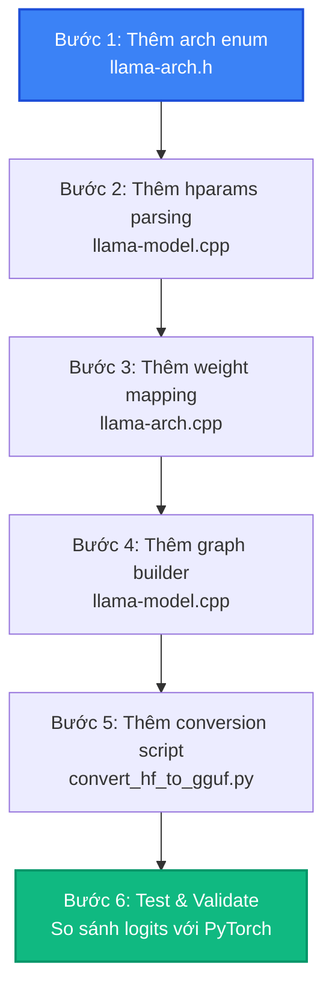

# Bài 5: Porting Model PyTorch sang GGUF

Một trong những câu hỏi phổ biến nhất từ cộng đồng llama.cpp là: **"Làm sao để chạy mô hình mới của tôi trên llama.cpp?"**. Bài này sẽ trả lời câu hỏi đó bằng cách phân tích hệ thống architecture registry, quy trình ánh xạ trọng số từ PyTorch sang GGUF, và hướng dẫn từng bước thêm một kiến trúc mô hình mới.

---

## 1. Hệ thống Architecture Registry

llama.cpp hỗ trợ **hơn 130 kiến trúc mô hình** (Llama, Mistral, Phi, Qwen, Gemma, Command-R, ...). Mỗi kiến trúc được đăng ký trong `llama-arch.h` thông qua một hệ thống registry:

```cpp
// Trong llama-arch.cpp: Định nghĩa enum cho mỗi architecture
enum llm_arch {
    LLM_ARCH_LLAMA,
    LLM_ARCH_FALCON,
    LLM_ARCH_BAICHUAN,
    LLM_ARCH_GROK,
    LLM_ARCH_GPT2,
    LLM_ARCH_GPTJ,
    LLM_ARCH_GPTNEOX,
    LLM_ARCH_MPT,
    LLM_ARCH_STARCODER,
    LLM_ARCH_REFACT,
    LLM_ARCH_BERT,
    LLM_ARCH_NOMIC_BERT,
    LLM_ARCH_PHI2,
    LLM_ARCH_PHI3,
    LLM_ARCH_QWEN,
    LLM_ARCH_QWEN2,
    // ... 80+ architectures
    LLM_ARCH_UNKNOWN,
};
```

Mỗi architecture cần đăng ký:
1. **Tensor name mapping**: Ánh xạ tên tensor PyTorch sang tên GGUF.
2. **Hyperparameters**: Số layers, heads, embedding dim, v.v.
3. **Graph builder**: Cách xây dựng computation graph cho forward pass.

---

## 2. Ánh xạ PyTorch Layers sang GGUF Tensors

### 2.1. Naming Convention

GGUF sử dụng naming convention riêng, khác với HuggingFace:

| HuggingFace (PyTorch) | GGUF (llama.cpp) |
|:---|:---|
| `model.embed_tokens.weight` | `token_embd.weight` |
| `model.layers.0.self_attn.q_proj.weight` | `blk.0.attn_q.weight` |
| `model.layers.0.self_attn.k_proj.weight` | `blk.0.attn_k.weight` |
| `model.layers.0.self_attn.v_proj.weight` | `blk.0.attn_v.weight` |
| `model.layers.0.self_attn.o_proj.weight` | `blk.0.attn_output.weight` |
| `model.layers.0.mlp.gate_proj.weight` | `blk.0.ffn_gate.weight` |
| `model.layers.0.mlp.up_proj.weight` | `blk.0.ffn_up.weight` |
| `model.layers.0.mlp.down_proj.weight` | `blk.0.ffn_down.weight` |
| `model.layers.0.input_layernorm.weight` | `blk.0.attn_norm.weight` |
| `model.layers.0.post_attention_layernorm.weight` | `blk.0.ffn_norm.weight` |
| `model.norm.weight` | `output_norm.weight` |
| `lm_head.weight` | `output.weight` |

### 2.2. Dimension Transposition

Một số tensor cần transposition khi convert:

```python
# Trong convert_hf_to_gguf.py:
# Attention weights: PyTorch lưu [out_features, in_features]
# GGUF cần [in_features, out_features] cho matrix multiplication
q_proj = tensor.transpose(0, 1)  # Transpose trước khi lưu vào GGUF
```

### 2.3. GQA (Grouped Query Attention) Mapping

Với GQA (như Llama-3-8B có 32 attention heads nhưng chỉ 8 KV heads):

```
PyTorch:
  q_proj: [4096, 4096]      (32 heads × 128 dim)
  k_proj: [1024, 4096]      (8 heads × 128 dim)
  v_proj: [1024, 4096]      (8 heads × 128 dim)

GGUF:
  attn_q.weight:  [4096, 4096]  (giữ nguyên)
  attn_k.weight:  [4096, 1024]  (transpose)
  attn_v.weight:  [4096, 1024]  (transpose)
```

---

## 3. Quy trình thêm kiến trúc mới (Step-by-step)



### Bước 1: Thêm Architecture Enum

Trong `llama-arch.h`, thêm enum mới:

```cpp
enum llm_arch {
    // ... existing architectures ...
    LLM_ARCH_MY_MODEL,  // Thêm mới
};
```

### Bước 2: Parse Hyperparameters

Trong `llama-model.cpp`, thêm logic đọc hyperparameters từ GGUF metadata:

```cpp
case LLM_ARCH_MY_MODEL:
    hparams.n_layer     = get_uint32("my_model.block_count");
    hparams.n_head      = get_uint32("my_model.attention.head_count");
    hparams.n_embd      = get_uint32("my_model.embedding_length");
    hparams.n_ff        = get_uint32("my_model.feed_forward_length");
    break;
```

### Bước 3: Weight Name Mapping

Trong `llama-arch.cpp`, đăng ký mapping từ tên GGUF sang tensor ID:

```cpp
static const std::map<llm_arch, std::map<std::string, llm_tensor>> LLM_TENSOR_NAMES = {
    {LLM_ARCH_MY_MODEL, {
        {"token_embd",     LLM_TENSOR_TOKEN_EMBD},
        {"output_norm",    LLM_TENSOR_OUTPUT_NORM},
        {"output",         LLM_TENSOR_OUTPUT},
        {"blk.%d.attn_q",  LLM_TENSOR_ATTN_Q},
        {"blk.%d.attn_k",  LLM_TENSOR_ATTN_K},
        {"blk.%d.attn_v",  LLM_TENSOR_ATTN_V},
        {"blk.%d.attn_output", LLM_TENSOR_ATTN_OUT},
        {"blk.%d.ffn_gate",    LLM_TENSOR_FFN_GATE},
        {"blk.%d.ffn_up",      LLM_TENSOR_FFN_UP},
        {"blk.%d.ffn_down",    LLM_TENSOR_FFN_DOWN},
        // ...
    }},
};
```

### Bước 4: Graph Builder

Trong `llama-model.cpp`, implement `build_graph()` cho kiến trúc mới:

```cpp
struct llm_build_context {
    // Xây dựng computation graph cho MY_MODEL
    ggml_cgraph * build_my_model() {
        // 1. Embedding lookup
        cur = llm_build_inp_embd(ctx0, hparams, ...);

        for (int il = 0; il < n_layer; ++il) {
            // 2. Layer norm
            cur = llm_build_norm(ctx0, cur, hparams, model.layers[il].attn_norm, ...);

            // 3. Self-attention
            cur = llm_build_attention(ctx0, cur, hparams, model.layers[il], ...);

            // 4. Residual connection
            cur = ggml_add(ctx0, cur, inpL);

            // 5. FFN
            cur = llm_build_ffn(ctx0, cur, model.layers[il], ...);
        }

        // 6. Output norm + LM head
        cur = llm_build_norm(ctx0, cur, hparams, model.output_norm, ...);
        cur = llm_build_lm_head(ctx0, cur, model.output, ...);
        return gf;
    }
};
```

### Bước 5: Conversion Script

Trong `convert_hf_to_gguf.py`, thêm class cho model mới:

```python
class MyModelModel(Model):
    model_arch = gguf.MODEL_ARCH.MY_MODEL

    def set_gguf_parameters(self):
        self.gguf_writer.add_block_count(self.hparams["num_hidden_layers"])
        self.gguf_writer.add_context_length(self.hparams["max_position_embeddings"])
        self.gguf_writer.add_embedding_length(self.hparams["hidden_size"])
        # ...

    def modify_tensors(self, data_torch, name, bid):
        # Transform tensors nếu cần (transpose, merge, ...)
        return super().modify_tensors(data_torch, name, bid)
```

---

## 4. Conversion Pipeline End-to-End

```bash
# Bước 1: Clone model từ HuggingFace
git lfs install
git clone https://huggingface.co/org/my-model

# Bước 2: Convert sang GGUF FP16
python convert_hf_to_gguf.py my-model/ --outfile my-model-f16.gguf

# Bước 3: (Tùy chọn) Quantize
./llama-quantize my-model-f16.gguf my-model-q4_k_m.gguf Q4_K_M

# Bước 4: Test inference
./llama-cli -m my-model-q4_k_m.gguf -p "Hello, world!" -n 50
```

---

## 5. Checklist: Thêm Model mới

| Bước | File | Hành động |
|:---|:---|:---|
| 1 | `llama-arch.h` | Thêm `LLM_ARCH_MY_MODEL` enum |
| 2 | `llama-arch.cpp` | Đăng ký tensor name mapping |
| 3 | `llama-model.cpp` | Parse hyperparameters + build graph |
| 4 | `convert_hf_to_gguf.py` | Thêm conversion class |
| 5 | Test | So sánh logits giữa PyTorch và llama.cpp |
| 6 | PR | Submit Pull Request lên llama.cpp repo |

---

## 💡 Đúc kết Bài 5

Porting model sang llama.cpp không phải là "viết lại model" mà là **ánh xạ** model architecture hiện có sang hệ thống abstraction của llama.cpp. Ba thành phần chính cần implement:

1. **Tensor name mapping**: Từ HuggingFace naming sang GGUF naming.
2. **Hyperparameter parsing**: Đọc architecture-specific config từ GGUF metadata.
3. **Graph builder**: Xây dựng computation graph cho forward pass.

File `convert_hf_to_gguf.py` là entry point, với logic conversion được chia nhỏ trong thư mục `conversion/` (hơn 15,000 dòng, 900KB, một file riêng cho mỗi architecture) là công cụ chính cho quá trình conversion, với class riêng cho mỗi architecture.
