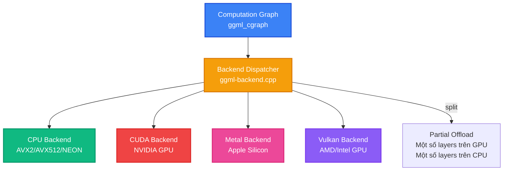
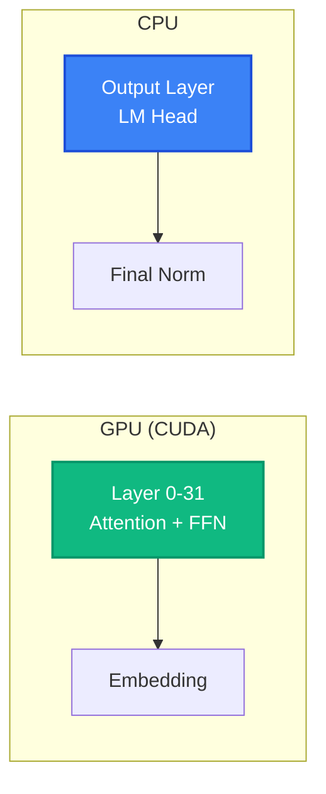

# Bài 6: Hardware Backends - CPU, CUDA, Metal, Vulkan

Sức mạnh thực sự của llama.cpp nằm ở khả năng chạy trên **mọi phần cứng**, từ CPU laptop đến GPU datacenter, từ Apple Silicon đến Raspberry Pi. Kiến trúc **backend abstraction** cho phép cùng một computation graph GGML được dispatch đến các hardware khác nhau mà không cần thay đổi code mô hình.

---

## 1. Kiến trúc Backend Abstraction

GGML sử dụng kiến trúc **3-layer vtable** (trong `ggml-backend-impl.h`) để trừu tượng hóa hardware backends:

```c
// Layer 1: Backend stream interface (tính toán chính)
struct ggml_backend_i {
    const char * (*get_name)(ggml_backend_t backend);
    void         (*free)(ggml_backend_t backend);
    void         (*set_tensor_async)(ggml_backend_t, struct ggml_tensor *, const void *, size_t, size_t);
    void         (*get_tensor_async)(ggml_backend_t, const struct ggml_tensor *, void *, size_t, size_t);
    void         (*synchronize)(ggml_backend_t backend);
    enum ggml_status (*graph_compute)(ggml_backend_t, struct ggml_cgraph *);
    // ... graph_optimize, event management
};

// Layer 2: Device interface (khởi tạo và kiểm tra khả năng)
struct ggml_backend_device_i {
    const char * (*get_name)(ggml_backend_dev_t dev);
    ggml_backend_t (*init_backend)(ggml_backend_dev_t dev, const char * params);
    bool         (*supports_op)(ggml_backend_dev_t, const struct ggml_tensor *);
    // ... get_props, supports_buft
};

// Layer 3: Backend struct (đối tượng người dùng tương tác)
struct ggml_backend {
    ggml_guid_t              guid;
    struct ggml_backend_i    iface;      // vtable chính
    ggml_backend_dev_t       device;     // device handle
    void *                   context;    // backend-specific data
};
```

> **Lưu ý**: `alloc_buffer` không nằm trên `ggml_backend_i` mà trên `ggml_backend_buffer_type_i` (buffer type interface riêng biệt). `supports_op` nằm trên `ggml_backend_device_i`, không phải `ggml_backend_i`. Thiết kế này cho phép một device có nhiều buffer types khác nhau.

### 1.1. Backend Dispatch Flow



---

## 2. CPU Backend

CPU backend (`ggml/src/ggml-cpu/`) là backend mặc định và được tối ưu kỹ lưỡng nhất:

### 2.1. SIMD Dispatch Runtime

GGML detect CPU capabilities lúc runtime và dispatch đến implementation phù hợp:

```cpp
// Runtime CPU feature detection
struct ggml_cpu_features {
    bool has_avx;
    bool has_avx2;
    bool has_f16c;
    bool has_fma;
    bool has_avx512;
    bool has_avx512_vnni;
    bool has_neon;
    bool has_sve;
    // ...
};

// Dispatch: chọn implementation SIMD phù hợp
if (cpu_has_avx512()) {
    ggml_vec_dot_q4_0 = ggml_vec_dot_q4_0_avx512;   // 16 floats/lane
} else if (cpu_has_avx2()) {
    ggml_vec_dot_q4_0 = ggml_vec_dot_q4_0_avx2;     // 8 floats/lane
} else if (cpu_has_neon()) {
    ggml_vec_dot_q4_0 = ggml_vec_dot_q4_0_neon;     // 4 floats/lane
} else {
    ggml_vec_dot_q4_0 = ggml_vec_dot_q4_0_ref;      // Scalar fallback
}
```

### 2.2. Thread Pool

CPU backend sử dụng thread pool để parallelize computation:

```c
// Chia computation graph thành chunks, mỗi thread xử lý một chunk
// Matrix multiplication: chia theo rows của output matrix
// Attention: chia theo attention heads
ggml_graph_compute_with_ctx(ctx, graph, n_threads);
```

### 2.3. BLAS Integration

GGML có thể sử dụng external BLAS library (OpenBLAS, Intel MKL, Apple Accelerate) cho matrix multiplication lớn:

```bash
# Build với OpenBLAS
cmake -DGGML_BLAS=ON -DGGML_BLAS_VENDOR=OpenBLAS ..

# Build với Apple Accelerate (tự động trên macOS)
cmake -DGGML_ACCELERATE=ON ..
```

---

## 3. CUDA Backend

CUDA backend (`ggml/src/ggml-cuda/`, hơn 130 files) hỗ trợ NVIDIA GPU:

### 3.1. GPU Offloading

Người dùng có thể offload một phần hoặc toàn bộ layers lên GPU:

```c
params.n_gpu_layers = -1;  // Offload tất cả layers lên GPU
params.n_gpu_layers = 20;  // Offload 20 layers (phần còn lại trên CPU)
params.n_gpu_layers = 0;   // Chạy hoàn toàn trên CPU
```

### 3.2. Partial Offload Strategy



### 3.3. Quantized CUDA Kernels

CUDA backend có kernels tối ưu cho từng quantization type:

```cuda
// CUDA kernel cho Q4_0 matrix-vector multiplication
__global__ void dequantize_mul_mat_vec_q4_0(
    const void * vx, const float * y, float * dst, const int ncols) {
    // Mỗi warp xử lý một row của weight matrix
    // Load Q4_0 block, dequantize, dot product với activation
    // Warp-level reduction cho final sum
}
```

---

## 4. Metal Backend

Metal backend (`ggml/src/ggml-metal/`) tối ưu cho Apple Silicon:

### 4.1. Unified Memory Advantage

Apple Silicon có **unified memory** (RAM = VRAM), không cần copy data giữa CPU và GPU:

```
Apple M2: 16 GB unified memory
- Model weights accessible bởi cả CPU và GPU
- Zero copy overhead (không cần cudaMemcpy)
- Bandwidth: ~100 GB/s (M2), ~400 GB/s (M2 Ultra)
```

### 4.2. Metal Shaders

Metal backend sử dụng `.metal` shader files cho GPU computation:

```metal
// Matrix multiplication kernel cho quantized weights
kernel void kernel_mul_mat_q4_0_f32(
    device const void * src0,
    device const float * src1,
    device float * dst,
    constant int & ne00,
    uint3 tgpig[[threadgroup_position_in_grid]],
    uint  tiisg[[thread_index_in_simdgroup]]) {
    // SIMD-group (warp) processing
    // Dequantize Q4_0 block, accumulate dot products
}
```

---

## 5. Vulkan Backend

Vulkan backend (`ggml/src/ggml-vulkan/`) hỗ trợ AMD, Intel và các GPU không có CUDA:

- Cross-platform: Windows, Linux, macOS (qua MoltenVK).
- SPIR-V shaders biên dịch trước.
- Hỗ trợ AMD RDNA2/3, Intel Arc, integrated GPUs.

---

## 6. So sánh hiệu năng các Backend

| Backend | Hardware | Llama-3-8B Q4_K_M | Throughput |
|:---|:---|:---|:---|
| CPU (AVX2) | Ryzen 7 5800X | ~12 GB RAM | ~8 tok/s |
| CPU (NEON) | Apple M2 | ~5 GB unified | ~25 tok/s |
| CUDA | RTX 3090 | ~5 GB VRAM | ~80 tok/s |
| CUDA | RTX 4090 | ~5 GB VRAM | ~120 tok/s |
| Metal | Apple M2 Max | ~5 GB unified | ~60 tok/s |
| Vulkan | RX 7900 XTX | ~5 GB VRAM | ~70 tok/s |

---

## 💡 Đúc kết Bài 6

Backend abstraction cho phép llama.cpp đạt được **hardware democracy**: cùng một mô hình, cùng một code chạy trên mọi platform. Chiến lược **partial offload** đặc biệt hữu ích khi VRAM không đủ cho toàn bộ mô hình.
