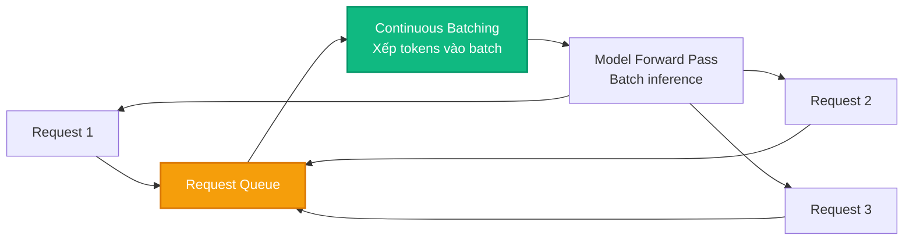
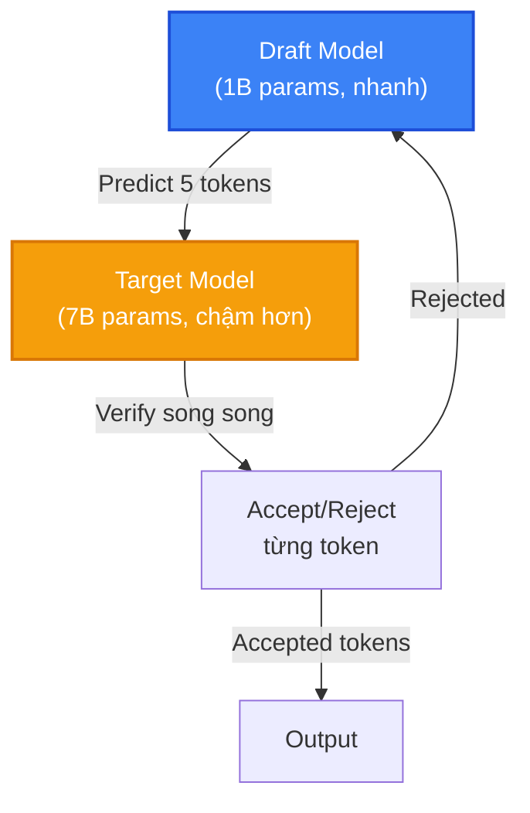

# Bài 7: llama.cpp Server, API và Tích hợp Hệ thống

llama.cpp không chỉ là một CLI tool. Nó cung cấp một **HTTP server** hoàn chỉnh với API tương thích OpenAI, hỗ trợ embedding generation, speculative decoding, và grammar-constrained generation. Bài này phân tích các khả năng tích hợp hệ thống của llama.cpp.

---

## 1. llama-server: OpenAI-Compatible API

`llama-server` (trong `examples/server/`) cung cấp REST API tương thích với OpenAI API:

```bash
# Khởi động server
./llama-server \
    -m model-q4_k_m.gguf \
    --host 0.0.0.0 \
    --port 8080 \
    -c 4096 \
    -ngl 99 \
    --parallel 4
```

### 1.1. Supported Endpoints

| Endpoint | Method | Mô tả |
|:---|:---|:---|
| `/v1/chat/completions` | POST | Chat completion (tương thích OpenAI) |
| `/v1/completions` | POST | Text completion |
| `/v1/embeddings` | POST | Generate embeddings |
| `/health` | GET | Health check |
| `/metrics` | GET | Prometheus metrics |
| `/props` | GET | Server properties |

### 1.2. Chat Completion Example

```bash
curl http://localhost:8080/v1/chat/completions \
  -H "Content-Type: application/json" \
  -d '{
    "model": "llama-3",
    "messages": [
      {"role": "system", "content": "Bạn là trợ lý AI."},
      {"role": "user", "content": "Giải thích quantization là gì?"}
    ],
    "temperature": 0.7,
    "max_tokens": 256,
    "stream": true
  }'
```

### 1.3. Concurrent Request Handling

llama-server hỗ trợ **continuous batching**:



Tham số `--parallel N` cho phép xử lý N requests đồng thời, mỗi request có slot KV Cache riêng.

---

## 2. Embedding Generation

llama.cpp hỗ trợ generate embeddings cho semantic search và retrieval:

```bash
./llama-embedding -m model.gguf -p "Câu văn cần embed" --pooling mean
```

Pooling strategies: `mean`, `cls`, `last`, `rank`.

---

## 3. Speculative Decoding

**Speculative decoding** sử dụng một mô hình nhỏ (draft model) để dự đoán trước nhiều tokens, rồi mô hình lớn (target model) verify song song:



```bash
# Speculative decoding: draft model + target model
./llama-speculative \
    -m target-7b.gguf \
    -md draft-1b.gguf \
    --draft 5 \
    -p "Hello world" \
    -n 100
```

Lợi ích: **2-3x speedup** khi acceptance rate cao (>70%).

---

## 4. Grammar-Constrained Generation

llama.cpp hỗ trợ **GBNF** (GGML BNF) grammar để kiểm soát output format:

```
# root.gbnf: Đảm bảo output là JSON object
root   ::= "{" ws pair ("," ws pair)* ws "}"
pair   ::= string ws ":" ws value
value  ::= string | number | object | array | bool | "null"
string ::= "\"" [^"\\]* "\""
number ::= [0-9]+ ("." [0-9]+)?
ws     ::= [ \t\n]*
```

```bash
./llama-cli -m model.gguf --grammar-file root.gbnf -p "Create a JSON..."
```

Ứng dụng: Đảm bảo output luôn là JSON hợp lệ, function calling, structured data extraction.

---

## 5. Python Integration

```python
# Sử dụng llama-cpp-python (Python bindings)
from llama_cpp import Llama

llm = Llama(
    model_path="model-q4_k_m.gguf",
    n_ctx=4096,
    n_gpu_layers=-1,
    n_threads=8,
)

# Chat completion
response = llm.create_chat_completion(
    messages=[
        {"role": "system", "content": "You are a helpful assistant."},
        {"role": "user", "content": "What is quantization?"}
    ],
    temperature=0.7,
    max_tokens=256,
)
print(response["choices"][0]["message"]["content"])
```

---

## 💡 Đúc kết Bài 7

llama.cpp cung cấp một **complete inference platform**, không chỉ là CLI tool. Server, API, embedding, speculative decoding và grammar constraints biến nó thành một giải pháp production-ready cho LLM deployment.
