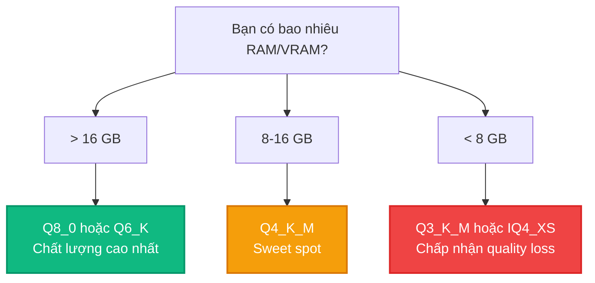

# Bài 8: Performance Tuning và Benchmarking

Sau khi hiểu kiến trúc inference, quantization và backends, bước cuối cùng là **tối ưu hiệu năng**. Bài này hướng dẫn cách benchmark, tuning, và chọn cấu hình tối ưu cho llama.cpp trên mọi hardware.

---

## 1. llama-bench: Đo hiệu năng

`llama-bench` (trong `examples/llama-bench/`) đo throughput cho prefill và decode:

```bash
./llama-bench -m model-q4_k_m.gguf -p 512 -n 128 -t 8 -ngl 99
```

Output mẫu:

```
| model        | size   | params | backend  | ngl | test   | t/s          |
|-------------|--------|--------|----------|-----|--------|--------------|
| LLaMA 8B Q4_K_M | 4.89 GiB | 8.03 B | CUDA    | 99  | pp 512 | 3245.12 ± 5  |
| LLaMA 8B Q4_K_M | 4.89 GiB | 8.03 B | CUDA    | 99  | tg 128 | 78.45 ± 0.3  |
```

- **pp 512**: Prompt processing throughput (512 tokens prefill).
- **tg 128**: Token generation throughput (128 tokens decode).

---

## 2. Flash Attention trong llama.cpp

**Flash Attention** là kỹ thuật tối ưu attention computation, giảm memory từ $O(n^2)$ xuống $O(n)$:

```c
struct llama_context_params params = llama_context_default_params();
params.flash_attn = true;  // Bật Flash Attention
```

Lợi ích:
- Giảm peak memory cho long-context inference.
- Tăng throughput khi context length > 2048.
- Hoạt động trên cả CPU và GPU backends.

---

## 3. Context Shift cho Long Context

Khi context length vượt quá `n_ctx`, llama.cpp hỗ trợ **context shift**:

```bash
./llama-cli -m model.gguf -c 4096 --ctx-shift
```

Context shift xóa một phần KV Cache cũ và shift phần còn lại, cho phép tiếp tục generation mà không cần restart.

---

## 4. KV Cache Quantization

Giảm bộ nhớ KV Cache bằng cách quantize K và V:

```c
params.type_k = GGML_TYPE_Q8_0;  // Quantize keys to 8-bit
params.type_v = GGML_TYPE_Q4_0;  // Quantize values to 4-bit
```

| KV Type | Memory (4K ctx, 8B model) | Quality Impact |
|:---|:---|:---|
| FP16 | 1.0 GB | Baseline |
| Q8_0 | 0.53 GB | Minimal (dưới 0.1 PPL) |
| Q4_0 | 0.28 GB | Noticeable (~0.5 PPL) |

---

## 5. Chiến lược chọn Quant phù hợp Hardware



---

## 6. Memory Optimization Checklist

| Kỹ thuật | Lệnh/Cấu hình | Tiết kiệm |
|:---|:---|:---|
| mmap (default) | Tự động | Không load toàn bộ vào RAM |
| KV Cache Q8_0 | `--cache-type-k q8_0` | ~50% KV memory |
| Flash Attention | `--flash-attn` | Giảm peak memory |
| Partial offload | `-ngl 20` | Chia tải CPU/GPU |
| Thread tuning | `-t 8` | Tối ưu CPU utilization |
| Batch size tuning | `-b 512` | Tối ưu prefill throughput |

---

## 💡 Đúc kết Bài 8

Performance tuning trong llama.cpp xoay quanh ba trục: **chọn quant phù hợp**, **tối ưu memory** (KV Cache, Flash Attention), và **tuning hardware** (threads, GPU layers). `llama-bench` là công cụ không thể thiếu để đo lường hiệu quả của mỗi thay đổi.
