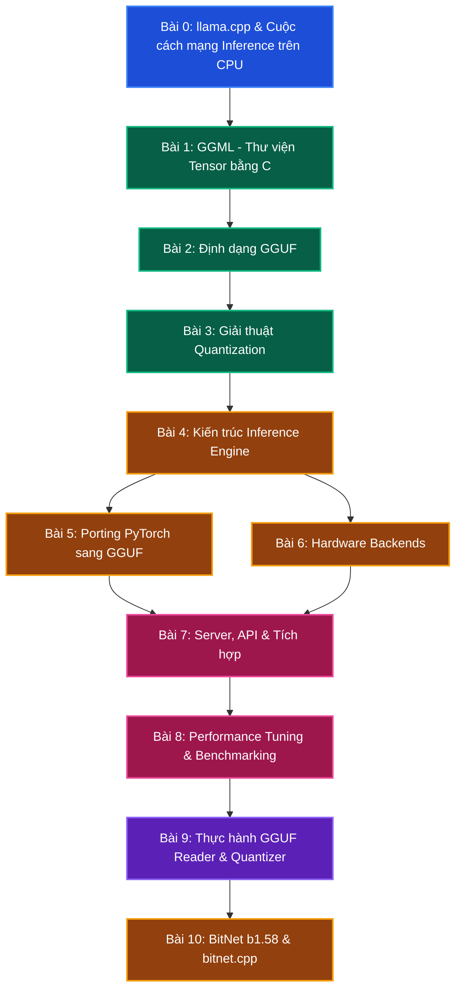

# Lộ trình học tập & Phân tích cấu trúc thư viện llama.cpp

Chào mừng bạn đến với tài liệu phân tích chuyên sâu về kiến trúc và hiện thực của thư viện **llama.cpp**, công cụ suy luận (inference) mô hình ngôn ngữ lớn mã nguồn mở phổ biến nhất thế giới, do Georgi Gerganov khởi xướng và được cộng đồng hơn 700 lập trình viên đóng góp.

Trong bối cảnh các mô hình LLM ngày càng lớn (từ 7B đến 405B tham số), việc triển khai inference hiệu quả trên đa dạng phần cứng (từ CPU laptop, Raspberry Pi, đến cụm GPU datacenter) trở thành một thách thức kỹ thuật then chốt. Thư viện `llama.cpp` ra đời nhằm giải quyết bài toán này bằng cách kết hợp ba đột phá: thư viện tensor GGML tối ưu cho CPU, định dạng GGUF hỗ trợ quantization linh hoạt, và kiến trúc multi-backend trừu tượng hóa phần cứng.

Dưới đây là giáo trình tự học gồm 11 bài học đi từ lý thuyết nền tảng đến chi tiết hiện thực và tối ưu hiệu năng của `llama.cpp`.

---

---

## Tóm tắt Giáo trình 11 Bài học

### 📌 Phần 1: Kiến thức nền tảng (Background & Foundations)
* **[Bài 0: llama.cpp và Cuộc cách mạng Inference trên CPU](lesson_0_cpp_inference_revolution)**
  * Tại sao Georgi Gerganov tạo ra llama.cpp vào tháng 3/2023?
  * Bài toán chạy LLM không cần GPU đắt tiền: memory bandwidth bottleneck.
  * Tổng quan landscape inference: llama.cpp vs ONNX Runtime vs TensorRT-LLM vs vLLM.
* **[Bài 1: GGML - Thư viện Tensor bằng C không phụ thuộc](lesson_1_ggml_tensor_library)**
  * Cấu trúc `ggml_tensor`, hệ thống 35 kiểu dữ liệu, arena memory allocation.
  * Computation graph (`ggml_cgraph`), cơ chế forward pass.
  * Tối ưu SIMD: AVX2, AVX512, ARM NEON dispatch.
* **[Bài 2: Định dạng GGUF - Cấu trúc nhị phân và Thiết kế](lesson_2_gguf_binary_format)**
  * Cấu trúc file GGUF: Header, metadata key-value, tensor info, tensor data.
  * 32-byte alignment cho SIMD, lịch sử phiên bản GGML sang GGUF.
  * Lập trình đọc/ghi GGUF bằng Python (`gguf-py`) và C.

### 📌 Phần 2: Giải thuật & Kiến trúc cốt lõi (Core Theory)
* **[Bài 3: Giải thuật Quantization - Từ Lý thuyết đến Hiện thực](lesson_3_quantization_algorithms)**
  * Block quantization cơ bản: Q4_0, Q4_1, Q5_0, Q5_1, Q8_0.
  * K-quants (super-blocks): Q2_K đến Q6_K.
  * I-quants (importance-based): IQ2_XXS đến IQ4_NL.
  * Toán học quantization error và SQNR.
* **[Bài 4: Kiến trúc Inference Engine của llama.cpp](lesson_4_inference_engine)**
  * Context creation (`llama_context`), KV Cache implementation.
  * Token sampling: top-k, top-p, temperature, min-p, grammar-constrained.
  * Batch processing, graph building, chu kỳ inference hoàn chỉnh.

### 📌 Phần 3: Phân tích sâu mã nguồn & Tích hợp (Deep Dive & Integration)
* **[Bài 5: Porting Model PyTorch sang GGUF](lesson_5_pytorch_to_gguf)**
  * Hệ thống architecture registry trong `llama-arch.cpp`.
  * Ánh xạ trọng số PyTorch sang GGUF tensors.
  * Quy trình thêm kiến trúc mô hình mới, conversion scripts.
* **[Bài 6: Hardware Backends - CPU, CUDA, Metal, Vulkan](lesson_6_hardware_backends)**
  * Kiến trúc backend abstraction (`ggml-backend.h`).
  * CPU backend: SIMD dispatch, thread pool, BLAS integration.
  * CUDA, Metal, Vulkan backends: GPU offloading strategies.
* **[Bài 7: llama.cpp Server, API và Tích hợp Hệ thống](lesson_7_server_and_integration)**
  * OpenAI-compatible API server, embedding generation.
  * Speculative decoding, grammar-constrained generation.
  * Integration patterns: Python bindings, C API.

### 📌 Phần 4: Tối ưu nâng cao & Thực hành (Optimization & Practice)
* **[Bài 8: Performance Tuning và Benchmarking](lesson_8_performance_tuning)**
  * llama-bench, Flash Attention adaptation, context shift optimization.
  * KV Cache quantization, chiến lược chọn quant phù hợp hardware.
  * Memory optimization: mmap vs load, partial offloading.
* **[Bài 9: Thực hành - Tự viết GGUF Reader và Quantization](lesson_9_hands_on_gguf)**
  * Tự tay lập trình GGUF file reader bằng Python từ đầu.
  * Implement Q8_0 quantization/dequantization.
  * So sánh chất lượng trọng số với bản FP16 gốc.
* **[Bài 10: BitNet b1.58 & bitnet.cpp - Inference cho LLM Ternary](lesson_10_bitnet_cpp)**
  * Kiến trúc BitNet b1.58: ternary weights {-1, 0, +1}, 1.58 bits/weight.
  * BitLinear layer: absmean quantization, addition-only matmul, scale absorption.
  * Kernel library: I2_S (MAD), TL1/TL2 (LUT), so sánh với llama.cpp TQ.
  * QAT với STE, performance 1.7x-6.17x, energy 55-82% reduction.
