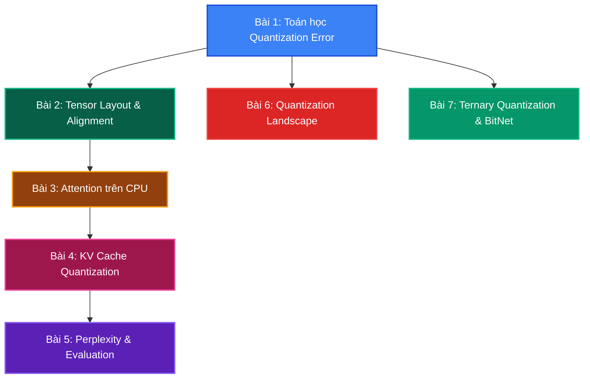

# Lộ trình Lý thuyết & Toán học của llama.cpp

Chào mừng bạn đến với chương **Đào sâu Lý thuyết, Toán học và Giải thuật (Math & Theory Deep Dive)**.

Để làm chủ hoàn toàn hệ thống inference LLM, chúng ta phải vượt qua lớp vỏ giao diện và đi vào gốc rễ toán học của các giải thuật quantization, tensor layout, attention optimization, và evaluation metrics. Phần này cung cấp các chứng minh toán học đầy đủ, phân tích độ phức tạp, và mã giả đi kèm tham chiếu mã nguồn `llama.cpp`.

---

---

## Nội dung các bài giảng Toán học chuyên sâu

1. **[Bài 1: Toán học Quantization Error & Information Loss](theory_1_quantization_error_math)**
   * MSE analysis, SQNR, Lloyd-Max algorithm, perplexity degradation curves.
2. **[Bài 2: Đại số Tensor Layout & Memory Alignment](theory_2_tensor_layout_alignment)**
   * Stride computation, SIMD alignment math, block packing algebra.
3. **[Bài 3: Attention Mechanism trên CPU](theory_3_attention_on_cpu)**
   * KV Cache optimization, Flash Attention for CPU, RoPE mathematics.
4. **[Bài 4: KV Cache Quantization](theory_4_kv_cache_quantization)**
   * Memory footprint math, Type-0 vs Type-1, attention quality under quantization.
5. **[Bài 5: Perplexity & Evaluation Metrics](theory_5_perplexity_evaluation)**
   * Cross-entropy, PPL formula, benchmark methodology, statistical testing.
6. **[Bài 6: Cảnh giác Quantization - GGML vs GPTQ vs AWQ vs QAT](theory_6_quantization_landscape)**
   * Hessian-based OBQ, activation-aware scaling, STE, PTQ vs QAT paradigm comparison.
7. **[Bài 7: Toán học Ternary Quantization & BitNet b1.58](theory_7_ternary_quantization)**
   * Information theory log₂(3), absmean quantization, addition-only matmul, scale absorption, STE, LUT mpGEMM.
