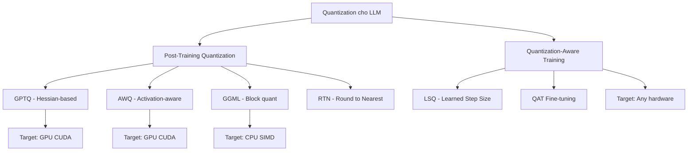

# Theory 6: Cảnh giác Quantization - So sánh GGML, GPTQ, AWQ và QAT

Trong khi Bài 3 đã đi sâu vào hệ thống quantization nội tại của llama.cpp (Q4_0 đến I-quants), thế giới quantization LLM rộng hơn nhiều. Lý thuyết này phân tích chi tiết 4 trường phái quantization chính: **GGML block quantization** (llama.cpp), **GPTQ** (Hessian-based), **AWQ** (activation-aware), và **QAT** (quantization-aware training), giúp bạn đưa ra quyết định chính xác cho từng use case.

---

## 1. Tổng quan: PTQ vs QAT

Trước khi đi vào từng phương pháp, cần hiểu hai paradigm lớn:

| Tiêu chí | PTQ (GPTQ, AWQ, GGML) | QAT |
|:---|:---|:---|
| **Thời điểm** | Sau khi huấn luyện xong | Trong quá trình huấn luyện/fine-tune |
| **Retraining** | Không (hoặc calibration nhẹ) | Có (fine-tune với fake quantization) |
| **Thời gian** | Vài phút đến vài giờ | Vài giờ đến vài ngày |
| **Chất lượng 4-bit** | Rất tốt (tăng PPL 1-3%) | Xuất sắc (tăng PPL dưới 1%) |
| **Chất lượng 2-bit** | Giảm đáng kể | Chấp nhận được nếu cẩn thận |
| **Chi phí compute** | Thấp | Cao (tương đương partial training) |

---

## 2. GPTQ: Hessian-based Optimal Quantization

### 2.1. Nguồn gốc

**Paper**: "GPTQ: Accurate Post-Training Quantization for Generative Pre-trained Transformers"
**Tác giả**: Elias Frantar, Saleh Ashkboos, Torsten Hoefler, Dan Alistarh (IST Austria / ETH Zurich)
**Năm**: 2022, accepted tại ICLR 2023

GPTQ dựa trên **Optimal Brain Quantization (OBQ)**, xuất phát từ framework **Optimal Brain Surgeon (OBS)** (Hassabi & Stork, 1993). Ý tưởng cốt lõi: quantization là một **bài toán tối ưu hóa**, không phải làm tròn ngây thơ.

### 2.2. Thuật toán

GPTQ quantize từng layer một, giải bài toán reconstruction:

$$\mathcal{L}(\hat{W}) = \|WX - \hat{W}X\|_F^2$$

Khai triển để lộ **Hessian matrix** $H = 2XX^T$, chứa thông tin tương quan giữa các input (second-order information):

$$\mathcal{L}(\hat{w}) = \frac{1}{2}(w - \hat{w})H(w - \hat{w})^T$$

**Quy trình từng bước:**

1. Xử lý weights **theo từng cột** (thứ tự cố định).
2. Quantize cột hiện tại bằng round-to-nearest.
3. Tính quantization error: $\delta = w_i - \text{quant}(w_i)$.
4. **Lan truyền error** sang tất cả cột chưa quantize bằng công thức OBQ closed-form:

$$\delta_j = -\frac{\delta_i}{[H^{-1}]_{ii}} \cdot [H^{-1}]_{ij}$$

5. Bù đắp error trước khi quantize weight tiếp theo.

**Tối ưu hóa quan trọng**: Thay vì tính lại $H^{-1}$ sau mỗi cột (O(d³) mỗi lần), GPTQ dùng **Cholesky decomposition reformulation** để update inverse trong O(d²), khả thi cho các layer lớn.

### 2.3. Cấu hình

| Tham số | Giá trị |
|:---|:---|
| Granularity | Per-group (group-wise) |
| Group size | 128 (mặc định), đôi khi 64 |
| Bit-width | 3-bit, 4-bit (chính), 2-bit (aggressive) |
| Calibration data | 128-2048 tokens (C4, WikiText) |
| Ký hiệu | w4a16g128 = 4-bit weights, 16-bit activations, group 128 |

### 2.4. Kết quả nổi bật

- Lần đầu tiên chạy **OPT-175B** trên **1 GPU 24GB** (RTX 3090/4090).
- Nén từ ~130GB (FP16) xuống ~35GB (4-bit).
- PPL tại 4-bit: OPT-175B ~10.86 vs FP16 ~10.63 trên WikiText2.
- Thời gian quantize: ~4 GPU-hours cho 175B, vài phút cho 7B-13B.

---

## 3. AWQ: Activation-Aware Weight Quantization

### 3.1. Nguồn gốc

**Paper**: "AWQ: Activation-aware Weight Quantization for LLM Compression and Acceleration"
**Tác giả**: Ji Lin, Jiaming Tang, Haotian Tang et al. (MIT Han Lab, nhóm Song Han)
**Năm**: 2023, accepted tại MLSys 2024

### 3.2. Insight cốt lõi

Không phải tất cả weights đều quan trọng như nhau. **Salient weights** (những weight được nhân với **activation lớn**) đóng góp không cân xứng vào quantization error:

$$\text{Err}(Q(w) \cdot x) = \Delta \cdot \text{RoundErr}\left(\frac{w}{\Delta}\right) \cdot x$$

Do đó, bảo vệ các channel có activation lớn sẽ giảm error nhiều hơn bảo vệ channel có weight lớn.

### 3.3. Thuật toán

1. **Profile activations**: chạy calibration data, tính per-channel average activation magnitude:

$$s_x = \mathbb{E}_{x \sim X}[|x|]$$

2. **Xác định scaling factors**: tìm per-channel scale tối ưu:

$$s^* = s_x^{\alpha^*}$$

trong đó $\alpha^* \in [0, 1]$ được tìm bằng **grid search** minimizing reconstruction loss.

3. **Equivalent transformation**: scale weights lên, activations xuống:

$$y \approx Q(w \cdot \text{diag}(s)) \cdot (\text{diag}(s)^{-1} \cdot x)$$

Channels có activation lớn nhận weight scale lớn hơn, giúp chúng có **quantization resolution mịn hơn** trong group.

4. **Fuse vào LayerNorm**: scaling $\text{diag}(s)^{-1}$ được fuse vào LayerNorm phía trước, **zero runtime overhead**.

### 3.4. So sánh AWQ vs GPTQ

| Tiêu chí | GPTQ | AWQ |
|:---|:---|:---|
| **Ý tưởng** | Hessian-based error compensation | Activation-aware scaling |
| **Độ phức tạp** | Cao (Cholesky, sequential column) | Thấp (grid search, simple scaling) |
| **Tốc độ quantize** | Chậm (~4 GPU-hrs cho 175B) | Nhanh (vài phút) |
| **Chất lượng 4-bit** | Xuất sắc (~FP16) | Xuất sắc (~FP16), thường nhỉnh hơn GPTQ |
| **Chất lượng 3-bit** | Tốt | Thường tốt hơn GPTQ |
| **Runtime overhead** | Không | Không (fused vào LayerNorm) |

---

## 4. QAT: Quantization-Aware Training

### 4.1. Straight-Through Estimator (STE)

Hàm quantization $Q(w) = \Delta \cdot \text{round}(w / \Delta)$ **không khả vi** (round là step function). STE xấp xỉ gradient:

$$\frac{\partial Q(w)}{\partial w} \approx \begin{cases} 1 & \text{nếu } w \in [w_{min}, w_{max}] \\ 0 & \text{ngược lại} \end{cases}$$

Trong forward pass, quantization áp dụng bình thường. Trong backward pass, gradient đi qua **như thể không có quantization** (trong valid range). Điều này cho phép model học phân phối weight robust với quantization.

### 4.2. LSQ: Learned Step Size Quantization

**Paper**: Esser et al., IBM Research, ICLR 2020

Đột phá: xem **quantization scale $\Delta$ như một learnable parameter**, cập nhật bằng gradient descent:

$$Q(w, \Delta) = \text{clamp}\left(\text{round}\left(\frac{w}{\Delta}\right), -2^{b-1}, 2^{b-1}-1\right) \cdot \Delta$$

Gradient theo scale:

$$\frac{\partial Q}{\partial \Delta} \approx \text{round}(w/\Delta) - w/\Delta$$

LSQ+ (Qualcomm, 2020) mở rộng cho **asymmetric quantization** (học cả scale và zero-point).

### 4.3. Khi nào dùng QAT?

| Tình huống | Khuyến nghị |
|:---|:---|
| Deploy nhanh, 4+ bit | PTQ (GPTQ, AWQ) |
| Sub-4-bit (2-3 bit) cần chất lượng OK | QAT |
| Model production cần accuracy cao nhất | QAT |
| Compute budget hạn chế | PTQ |
| LLM lớn (70B+) không thể retrain | PTQ (GPTQ/AWQ) |

**Chi phí QAT**: tương đương partial training, từ tens đến hundreds GPU-hours cho 7B, thousands GPU-hours cho 70B+.

---

## 5. GGML Block Quantization (llama.cpp)

Nhắc lại từ Bài 3: llama.cpp dùng **block quantization** tối ưu cho CPU với SIMD:

| Format | Block | Metadata | Effective bits |
|:---|:---|:---|:---|
| Q4_0 | 32 weights | 1 scale (FP16) | 4.50 |
| Q4_K_M | 256 (super-block) | Global + 8 sub-scales | 4.85 |
| IQ4_NL | 256 (lookup table) | Importance-based | 4.50 |

**Điểm khác biệt cốt lõi so với GPTQ/AWQ:**

1. **Block-based, không phải group-based**: GGML dùng block 32 (hoặc super-block 256), GPTQ/AWQ dùng group 128. Block nhỏ hơn cho SIMD register fit tốt hơn.
2. **SIMD-optimized kernels**: dequantize on-the-fly trong matmul, weights nén trong L1/L2 cache.
3. **Không cần calibration data** (trừ I-quants).
4. **Single file GGUF**: một file chứa cả model + metadata, dễ phân phối.

---

## 6. So sánh toàn diện

### 6.1. Hardware target

| Phương pháp | Hardware chính | Kernel | Best for |
|:---|:---|:---|:---|
| GPTQ | NVIDIA GPU | ExLlamaV2, AutoGPTQ CUDA | Single-GPU inference |
| AWQ | NVIDIA GPU | AutoAWQ, TinyChat CUDA | GPU + edge (TinyChat) |
| GGML (llama.cpp) | CPU (AVX2/512/NEON) | SIMD hand-optimized | CPU-only, hybrid CPU+GPU |
| QAT | Any | Tùy runtime | Custom hardware (NPU, TPU) |

### 6.2. Calibration data

| Phương pháp | Calibration? | Lượng |
|:---|:---|:---|
| GPTQ | Có | 128-2048 tokens (C4, WikiText) |
| AWQ | Có | ~512 tokens (activation profiling) |
| GGML standard | Không | N/A |
| GGML I-quants | Có (importance matrix) | ~128-256 chunks |
| QAT | Full training data | Full dataset |

### 6.3. Chất lượng tại 4-bit (LLaMA-7B, WikiText-2)

| Phương pháp | PPL | Delta vs FP16 | Quantize time |
|:---|:---|:---|:---|
| FP16 (baseline) | 5.91 | 0.00 | - |
| GPTQ w4a16g128 | 6.01 | +0.10 | ~10 phút |
| AWQ w4a16g128 | 5.97 | +0.06 | ~5 phút |
| GGML Q4_K_M | 5.97 | +0.06 | ~1 phút |
| GGML IQ4_NL | 5.94 | +0.03 | ~30 phút (cả imatrix) |
| QAT 4-bit (LSQ) | 5.93 | +0.02 | Vài giờ (retrain) |

### 6.4. Decision matrix

| Use case | Best choice | Lý do |
|:---|:---|:---|
| Chạy 70B trên 1 GPU 24GB | GPTQ/AWQ 4-bit | GPU-optimized, fit VRAM |
| Chạy 7B trên laptop không GPU | GGML Q4_K_M | CPU SIMD, no GPU needed |
| Chạy model trên điện thoại | GGML Q4_0 hoặc AWQ TinyChat | ARM NEON hoặc mobile CUDA |
| Cần chất lượng cao nhất mọi giá | QAT fine-tune | Model learns to be quantized |
| Phân phối model dễ dàng | GGML GGUF | Single file, ollama-compatible |
| Quantize nhanh, không fuss | GGML Q4_K_M | No calibration, seconds |
| Sub-4-bit trên GPU | AWQ 3-bit hoặc QAT | AWQ giữ chất lượng tốt ở 3-bit |
| Hybrid CPU+GPU inference | GGML + partial offload | Flexible layer splitting |

---

## 7. Compatibility: GPTQ/AWQ models với llama.cpp

**Câu trả lời ngắn: Không dùng trực tiếp được.**

| Khía cạnh | GPTQ/AWQ | llama.cpp |
|:---|:---|:---|
| Format | Safetensors + config | GGUF (binary, single file) |
| Quant scheme | Per-group Hessian/activation | Block-wise, K-means adaptive |
| Kernel | CUDA (ExLlamaV2, AutoAWQ) | SIMD (AVX2/512/NEON) |
| Runtime | vLLM, TGI, AutoGPTQ | llama.cpp, ollama, LM Studio |

**Conversion path**: có thể convert GPTQ/AWQ model ngược về FP16, rồi re-quantize bằng llama.cpp. Tuy nhiên cách này:
- Tốn thời gian (dequantize + re-quantize).
- Lossy (tích lũy error từ 2 lần quantize).
- Defeat purpose (tại sao không quantize từ FP16 ngay?).

**Khuyến nghị**: dùng đúng tool cho đúng job:
- GPU inference: dùng GPTQ/AWQ trực tiếp.
- CPU/hybrid inference: quantize từ FP16/BF16 bằng `llama-quantize` ra GGUF.

---

## 8. Xu hướng tương lai

### 8.1. Convergence

Các phương pháp đang hội tụ:
- **I-quants** của llama.cpp vay mượn ý tưởng importance matrix từ GPTQ/AWQ.
- **AWQ** áp dụng activation-awareness tương tự importance-based approaches.
- **GPTQ** + calibration data gần giống với I-quant collection.

### 8.2. Emerging methods

- **SpQR** (Sparse + Quantization): giữ nguyên một số outlier weights (sparse) và quantize phần còn lại.
- **QuIP#**: tối ưu hóa quantization codebook bằng vector quantization.
- **AQLM**: Additive Quantization of Language Models, kết hợp nhiều codebooks.
- **1-bit LLMs** (BitNet): extreme quantization với ternary weights (-1, 0, 1), đang được nghiên cứu bởi Microsoft.

---

## 9. Đúc kết

Bốn trường phái quantization phục vụ các nhu cầu khác nhau:

1. **GPTQ**: Hessian-based, tối ưu cho GPU, chất lượng cao tại 3-4 bit, nhưng cần calibration data.
2. **AWQ**: Activation-aware, nhanh hơn GPTQ, chất lượng tương đương hoặc tốt hơn, cũng GPU-optimized.
3. **GGML (llama.cpp)**: Block-based, CPU-optimized, không cần calibration, single-file format, ideal cho deployment không GPU.
4. **QAT**: Retraining-based, chất lượng cao nhất nhưng đắt nhất, phù hợp khi accuracy là ưu tiên tuyệt đối.

**Q4_K_M của llama.cpp** đạt chất lượng tương đương AWQ/GPTQ 4-bit tại cùng bit-width, chứng tỏ block quantization thông minh trên CPU có thể cạnh tranh ngang hàng với các phương pháp Hessian-based trên GPU. Đây là lý do llama.cpp trở thành framework inference phổ biến nhất trong cộng đồng open-source.
