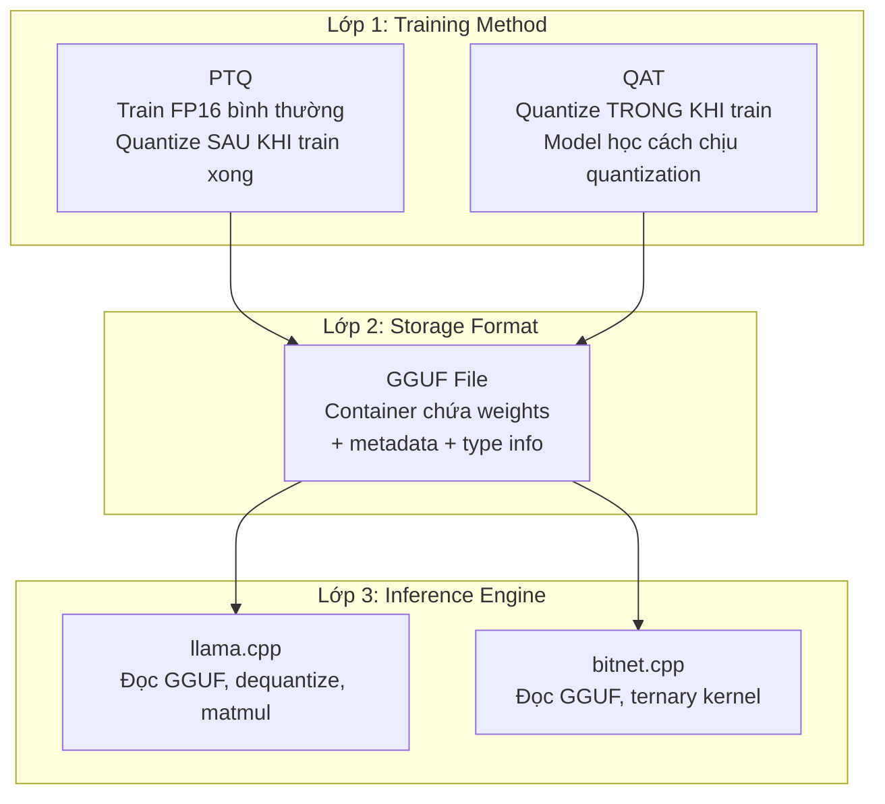
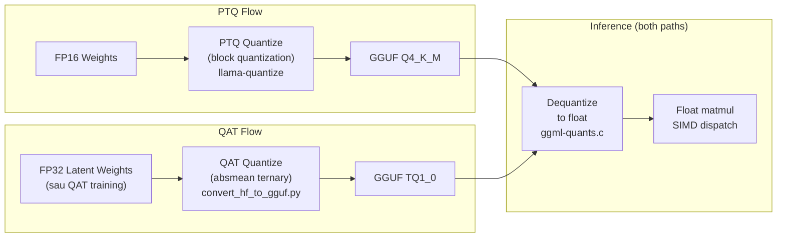

# Bài 8: Tại sao QAT Model chạy được trên PTQ Engine?

Một câu hỏi thường gặp gây nhầm lẫn: *"BitNet được train bằng QAT, llama.cpp là PTQ framework. Vậy tại sao model BitNet lại chạy được trên llama.cpp?"* Câu trả lời nằm ở việc phân biệt rõ ràng giữa ba khái niệm: **phương pháp training**, **định dạng lưu trữ**, và **engine inference**. Bài này phân tích sâu vấn đề dựa trên mã nguồn thực tế.

---

## 1. Ba lớp khái niệm thường bị nhầm lẫn



**Điểm mấu chốt**: GGUF là **container format** -- nó chỉ chứa bytes. Nó không biết và không quan tâm weights đến từ PTQ hay QAT. Inference engine đọc bytes từ GGUF và tính toán. Engine cũng không quan tâm weights được tạo ra bằng cách nào.

---

## 2. Pipeline cụ thể: BitNet QAT -> GGUF -> llama.cpp

### 2.1. Bước 1: Sau QAT Training

Sau khi train xong BitNet b1.58, HuggingFace model chứa:
- **Latent weights FP32**: Trọng số đầy đủ mà optimizer đã cập nhật
- **Weight scales**: Scale factor cho mỗi layer (dùng trong absmean quantization)
- **Architecture config**: `BitnetForCausalLM` trong `config.json`

Quan trọng: File HuggingFace **KHÔNG** chứa ternary weights {-1, 0, +1}. Nó chứa FP32 latent weights. Quantization thành ternary xảy ra **trong lúc convert sang GGUF**.

### 2.2. Bước 2: Convert HuggingFace -> GGUF

llama.cpp có dedicated converter cho BitNet. Trong `conversion/bitnet.py` (verified source):

```python
@ModelBase.register("BitnetForCausalLM")
class BitnetModel(TextModel):
    model_arch = gguf.MODEL_ARCH.BITNET
```

Và trong `conversion/base.py`, hàm `dequant_bitnet()` xử lý trọng số:

```python
def dequant_bitnet(weight: Tensor, scale: Tensor) -> Tensor:
    weight = weight.view(torch.uint8)
    # ... unpack packed ternary weights ...
    return (unpacked * scale.unsqueeze(-1).float()).reshape(shape)
```

Và trong `conversion/bitnet.py`, hàm quantize áp dụng **chính xác công thức absmean** mà model đã dùng trong training:

```python
iscale = 1 / scale
# Quantize: round then clamp to {-1, 0, +1}
result = (weight * iscale).round().clamp(-1, 1) / iscale
```

Khi chạy `convert_hf_to_gguf.py --outtype tq1_0`, converter:
1. Đọc FP32 latent weights từ HuggingFace
2. Áp dụng absmean quantization -> ternary {-1, 0, +1}
3. Pack vào **TQ1_0 block format** trong GGUF

### 2.3. Bước 3: llama.cpp đọc GGUF và inference

llama.cpp thấy GGUF file với `file_type = MOSTLY_TQ1_0` và đọc TQ1_0 blocks. Kernel thực hiện:

```c
// ggml-quants.c, line 2356 - dequantize_row_tq1_0
// Ternary dequantization (BitNet b1.58 and TriLMs)
void dequantize_row_tq1_0(const block_tq1_0 * x, float * y, int64_t k) {
    // Unpack ternary values from packed format
    // Multiply by scale to get float values
    // Output: float array for matmul
}
```

llama.cpp **dequantize ternary về float**, rồi thực hiện float matmul bình thường.

---

## 3. Câu trả lời cho câu hỏi gốc

### 3.1. Tại sao QAT model chạy được trên PTQ engine?

**Vì cả QAT và PTQ đều produce cùng một output format: GGUF file chứa quantized weights.**

| Stage | PTQ Model | QAT Model (BitNet) |
|:---|:---|:---|
| Training | Train FP16 bình thường | Train với quantization constraint |
| Weights sau training | FP16 | FP32 latent (sẽ quantize khi convert) |
| Convert step | `llama-quantize` áp dụng block quantization | `convert_hf_to_gguf.py --outtype tq1_0` áp dụng absmean |
| Output GGUF | Chứa Q4_K_M / Q8_0 / etc blocks | Chứa TQ1_0 / TQ2_0 blocks |
| llama.cpp đọc | Đọc Q4_K_M blocks, dequantize, matmul | Đọc TQ1_0 blocks, dequantize, matmul |

**llama.cpp không phân biệt**: Nó chỉ thấy "một GGUF file với weights ở type X" và xử lý theo đúng protocol của type đó.

### 3.2. Quantize vs Dequantize: Hai chiều khác nhau



Điểm tinh tế:
- **PTQ quantize** áp dụng block quantization lên model đã train xong
- **QAT quantize** áp dụng absmean ternary lên latent weights -- đây là **cùng một công thức** mà model đã dùng trong training forward pass
- **Dequantize** (tại inference): cả hai đều đi qua `dequantize_row_*` -> float -> matmul

### 3.3. "llama.cpp dùng PTQ" -- phát biểu chính xác hơn

llama.cpp **hỗ trợ** PTQ (tool `llama-quantize` quantize FP16 model). Nhưng llama.cpp cũng **hỗ trợ đọc** bất kỳ GGUF file nào, kể cả file chứa weights đã được QAT-quantize.

Nói chính xác:
- `llama-quantize`: PTQ tool (áp dụng quantization lên FP16 model)
- `convert_hf_to_gguf.py --outtype tq1_0`: QAT-aware converter (áp dụng absmean đúng như training)
- `llama-cli` / `llama-server`: Inference engine (chỉ đọc GGUF, không quantize)

---

## 4. Accuracy Gap: Tại sao llama.cpp TQ chỉ đạt 1.4%?

Mặc dù cùng đọc TQ1_0 GGUF file, llama.cpp và bitnet.cpp cho kết quả khác nhau:

| Engine | Dequantize strategy | Accuracy |
|:---|:---|:---|
| llama.cpp | Dequantize TQ1_0 -> float -> float matmul | 1.4% lossless |
| bitnet.cpp | Exact ternary computation (I2_S/TL1/TL2) | 100% lossless |

### 4.1. Nguyên nhân: Dequantize là Approximate

Trong `ggml-quants.c`, `dequantize_row_tq1_0`:

```c
// Unpack ternary value -> multiply by scale -> output float
// y[j] = ternary_value * scale
```

Bước "ternary_value * scale" tạo ra **float approximation**. Khi weight = +1 và scale = 0.003456, float representation của 0.003456 không chính xác tuyệt đối. Sai số nhỏ này tích lũy qua hàng tỷ phép nhân trong model.

### 4.2. bitnet.cpp: Exact Ternary Computation

bitnet.cpp **không dequantize**. Nó giữ nguyên ternary weights và thực hiện:

```c
// I2_S kernel (ggml-bitnet-mad.cpp)
// Weight = {-1, 0, +1} -> add/subtract activation
// Không có phép nhân float nào
// Accumulator là int16 (exact integer arithmetic)
```

Integer arithmetic là **exact**, không có rounding error. Đó là lý do bitnet.cpp đạt 100% accuracy.

### 4.3. Analogy

Hãy tưởng tượng weights là các phân số: 1/3, 2/7, 5/11.

- **llama.cpp**: Convert 1/3 -> 0.333333 (float), rồi tính toán với 0.333333. Sai số tích lũy.
- **bitnet.cpp**: Giữ nguyên "1/3" như một symbol, tính toán trực tiếp với symbol đó. Không sai số.

Cả hai đọc cùng một file chứa "1/3". Khác biệt nằm ở cách **xử lý** giá trị đó.

---

## 5. Convert Pipeline cho các QAT Framework khác

### 5.1. Tổng quát

Mọi QAT framework đều theo pattern tương tự:

```
QAT Training -> Export HuggingFace/safetensors
     -> Convert script reads weights, applies quantization formula
     -> Writes GGUF with appropriate quant type
     -> llama.cpp reads GGUF normally
```

### 5.2. Ví dụ: Gemma 1.58-bit (nếu có)

Nếu Google phát hành Gemma 1.58-bit QAT model:

1. Google train với QAT + ternary constraint (tương tự BitNet)
2. Export model dưới dạng HuggingFace safetensors (chứa FP32 latent + scales)
3. Community viết converter trong `convert_hf_to_gguf.py` (hoặc llama.cpp thêm `MODEL_ARCH.GEMMA_BITNET`)
4. Converter áp dụng absmean quantization -> TQ1_0 blocks trong GGUF
5. llama.cpp inference bình thường

### 5.3. Điều kiện cần để QAT model chạy trên llama.cpp

| Yêu cầu | BitNet | Lý do |
|:---|:---|:---|
| Architecture support | `MODEL_ARCH.BITNET` trong `constants.py` | llama.cpp biết cách map tensor names |
| Weight mapping | `tensor_mapping.py` có BitNet entries | Biết `self_attn.inner_attn_ln` -> ATTN_SUB_NORM |
| Quant type support | `TQ1_0`/`TQ2_0` trong `enum ggml_type` | GGML biết cách pack/unpack ternary |
| Converter class | `BitnetModel` trong `conversion/bitnet.py` | Biết cách quantize weights đúng cách |
| Kernel support | `quantize_row_tq1_0`, `dequantize_row_tq1_0` | CPU kernel để xử lý TQ blocks |

---

## 6. Khi nào KHÔNG convert được?

### 6.1. QAT với Custom Quantization Scheme

Nếu một QAT framework sử dụng quantization scheme mà llama.cpp **chưa hỗ trợ** (ví dụ: mixed-precision per-neuron, hoặc custom block size không phải 256), thì không thể convert sang GGUF cho đến khi:
- Có ai đó thêm quant type mới vào `enum ggml_type`
- Implement quantize/dequantize kernel trong `ggml-quants.c`
- Thêm converter class trong `conversion/`

### 6.2. QAT với Architecture khác

Nếu QAT model sử dụng kiến trúc mà llama.cpp chưa biết (không có `MODEL_ARCH` entry), converter sẽ fail vì không biết cách map tensor names.

---

## 7. Tóm tắt

| Câu hỏi | Câu trả lời |
|:---|:---|
| QAT model có convert sang GGUF được không? | **Có**, nếu llama.cpp hỗ trợ architecture + quant type |
| Tại sao? | GGUF là container format, không phân biệt PTQ vs QAT |
| `llama-quantize` có quantize QAT model được không? | **Không nên** -- sẽ re-quantize, phá hủy QAT optimization |
| Cách đúng để convert? | Dùng `convert_hf_to_gguf.py --outtype tq1_0` (áp dụng đúng absmean formula) |
| llama.cpp inference QAT model có chính xác không? | **Approximate** -- dequantize ternary -> float mất precision |
| bitnet.cpp inference QAT model có chính xác không? | **Exact** -- integer ternary computation, không dequantize |

**Insight cốt lõi**: PTQ và QAT không phải hai framework cạnh tranh nhau. Chúng là hai **phương pháp tạo weights** khác nhau, nhưng output đều nằm trong cùng một format (GGUF). Inference engine chỉ cần biết cách đọc format đó.

---

## Tham khảo mã nguồn (verified)

- `conversion/bitnet.py` -- BitNet converter class, `@ModelBase.register("BitnetForCausalLM")`
- `conversion/base.py` -- `dequant_bitnet()` function for unpacking BitNet weights
- `convert_hf_to_gguf.py` -- `--outtype tq1_0` and `--outtype tq2_0` options
- `ggml-quants.c` -- `quantize_row_tq1_0_ref()`, `dequantize_row_tq1_0()` implementations
- `ggml.c` -- `GGML_TYPE_TQ1_0` and `GGML_TYPE_TQ2_0` type registration
- `gguf-py/gguf/constants.py` -- `MODEL_ARCH.BITNET`, `GGMLQuantizationType.TQ1_0 = 34`
- `gguf-py/gguf/tensor_mapping.py` -- BitNet tensor name mappings (`inner_attn_ln`, `ffn_layernorm`)
